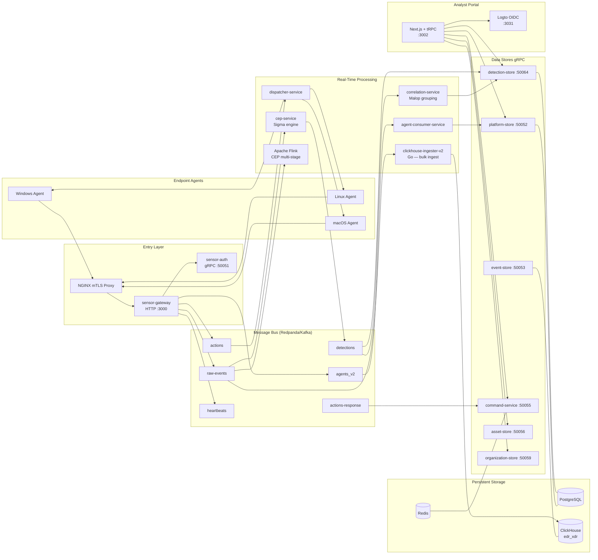
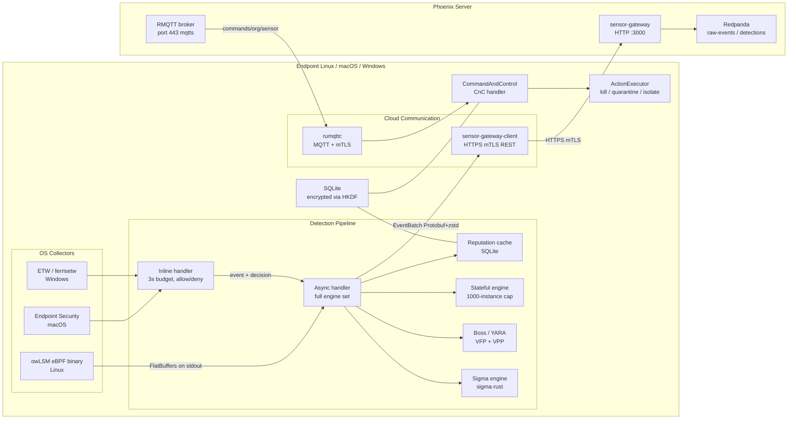

# Phoenix EDR/XDR Platform — Complete Architecture Overview

## Executive Summary

Phoenix is a cloud-hosted, multi-tenant Endpoint Detection and Response (EDR) / Extended Detection and Response (XDR) security platform developed by Cybereason. Its purpose is to collect security telemetry from customer endpoints, detect threats in real time using Sigma rules and Apache Flink Complex Event Processing, and give security analysts a centralized portal to investigate and respond to attacks. The platform is built on a two-component model: the Phoenix Server runs as a microservices cluster in the cloud or on-premises, while the Sunbird Agent is a lightweight Rust binary deployed on customer endpoints running Linux, macOS, or Windows. Phoenix is designed for enterprise security teams who need continuous visibility across their endpoint fleet, automated detection correlation, and one-click remote response — all with hard per-tenant data isolation so that multiple customer organizations can share a single platform deployment without risk of cross-tenant data exposure.

---

## System Boundaries

Two components, one platform:

| Component | Location | Language | Role |
|-----------|----------|----------|------|
| Phoenix Server | Cloud / on-prem | Rust (16+ services), Go, TypeScript | Detection engine, data store, analyst portal |
| Sunbird Agent | Customer endpoints | Rust | Event collection, local detection, command execution |
| phoenix-proto | Shared schemas | Protobuf | Canonical message contracts for all cross-component communication |

The split exists for two complementary reasons. First, the endpoint agent must operate even when the network is unavailable — local Sigma rules, reputation caching, and inline prevention all work offline. Second, complex multi-machine correlation (grouping events from 1,000 sensors into a single attack session) requires server-side state and storage at a scale that an endpoint binary cannot maintain. The agent handles what must happen with microsecond latency on the machine; the server handles everything that benefits from global visibility and persistent analytics.

The agent communicates outbound on two channels: HTTPS REST with Protobuf/zstd bodies to `sensor-gateway` for event delivery and registration, and MQTT over mTLS to the RMQTT broker for receiving commands. The channels are deliberately separated so that high-throughput telemetry delivery never delays a low-latency response command, and vice versa. The agent never connects to internal gRPC ports (e.g., port 50051 is `sensor-auth`, internal-only); all agent traffic enters through `sensor-gateway` at HTTP port 3000, behind an NGINX mTLS proxy.

---

## End-to-End Data Flows

### 1. Event Collection: Endpoint to Cloud

1. The OS generates a security event. On Linux, the owLSM eBPF binary detects a syscall (process exec, file write, network connect) and emits a size-prefixed FlatBuffer on its stdout pipe. On macOS, the Apple Endpoint Security framework delivers the event to the agent's `ES_EVENT_TYPE_NOTIFY_*` subscription. On Windows, an ETW kernel provider emits a trace record consumed by the `ferrisetw` crate.
2. `owlsm-rs` (Linux) or the platform-specific collector converts the raw OS event into a `SensorEvent` Rust struct and routes it into the detection pipeline via a crossbeam channel.
3. The detection pipeline evaluates the event through the Sigma engine, Boss/YARA VFP/VPP engines, and the stateful injection-detection engine (async path). For process-creation events, the reputation cache is checked first — a blacklist hit fires an inline deny before any engine runs.
4. Processed events are accumulated by `SunbirdLowPrioritySender` into an `EventBatch` Protobuf message and compressed with zstd at level 3.
5. `sensor-gateway-client` POSTs the batch over HTTPS (TLS 1.3, mTLS with the agent's short-term P-256 certificate) to `POST {mtls_url}/api/v1/orgs/{org_id}/sensors/{sensor_id}/events`.
6. NGINX terminates TLS and forwards to `sensor-gateway` (HTTP :3000). The gateway validates the mTLS header set by NGINX, extracts `org_id` and `sensor_id` from the URL path, deserializes the Protobuf body, and publishes each `SingleEvent` to the `raw-events` Redpanda/Kafka topic.
7. `clickhouse-ingester-v2` (Go) consumes `raw-events`, batches 5,000 messages, and bulk-inserts them into `edr_xdr.raw_events_local` (a `ReplicatedMergeTree` table partitioned by `(org_id, toDate(timestamp))`). Back-pressure logic pauses Kafka consumption when ClickHouse queue depth exceeds configurable thresholds.
8. In parallel, `cep-service` also consumes `raw-events` and evaluates every loaded Sigma rule in a parallel worker pool. A rule match produces a `Detection` protobuf published to the `detections` topic.

### 2. Detection and Alerting: Cloud Processing

1. `cep-service` publishes a `Detection` protobuf to the `detections` Kafka topic whenever a Sigma rule fires. The message carries `org_id`, affected sensor, rule metadata, MITRE ATT&CK tactic/technique tags, severity, and a reference to the triggering event.
2. `correlation-service` consumes `detections`. It maintains a rolling in-memory window (default 10,000 recent detections) and applies temporal correlation: multiple firings of the same rule on the same host are grouped, and different rules firing on the same host within five minutes are assembled into a parent Malop (Malicious Operation) record.
3. `correlation-service` calls `detection-store` (gRPC :50064) to persist the Malop and its child detections to PostgreSQL.
4. `mitre-tagging-service` (gRPC :50057) enriches the detection with MITRE ATT&CK tactic and technique labels matched by the rule's `engine_specific_name`.
5. `notification-service` monitors for new high-severity detections and, based on per-org settings from `notification-store`, calls `notification-dispatcher` to send alert emails via SendGrid or SMTP.
6. Apache Flink (dashboarded at :8081) consumes `raw-events` and `triggers` for multi-stage attack chain detection: CEP rules under `cep-rules/` define temporal correlation windows and field-equality linking conditions that can span dozens of events across minutes. Matched chains produce detections or trigger packets back to Kafka.
7. The portal queries `detection-store` via tRPC/gRPC to display the Malop list, timeline, and attack-path graph. `score-recompute` periodically recalculates detection severity scores in PostgreSQL.

### 3. Response and Command: Cloud to Endpoint

1. An analyst selects an action in the portal (Isolate Host, Kill Process, Quarantine File, Execute Script) via a tRPC call to the Next.js backend, which calls `command-service` (gRPC :50055).
2. `command-service` validates the request, checks permissions via `organization-store`, and records a pending action via `sensor-action-store` (gRPC :50054), which writes to PostgreSQL and a Redis hot-state key.
3. `command-service` publishes an `Action` protobuf to the `actions` Kafka topic. A background `ActionRetryJob` periodically re-publishes pending actions without responses, using a distributed lock from `platform-store` to prevent duplicate retries.
4. `dispatcher-service` consumes `actions` and routes the command based on the target sensor's connectivity type. For most agents: MQTT — it publishes the command payload to the RMQTT broker at `commands/organizations/{org_id}/sensors/{sensor_id}`. For Windows sensors: Windows Notification Service (WNS) push is attempted first as the lower-latency channel.
5. The agent's MQTT client (`rumqttc` library, QoS 1 subscription with `clean_session=true`) receives the payload and delivers it to `CommandAndControl`. The CnC handler decodes the `CommandControlResponse` protobuf and routes to `ActionExecutor` (kill process, host isolation via WFP, file quarantine) or internal handlers (policy update, upgrade, script execution).
6. The agent executes the action and POSTs the result to `POST {mtls_url}/api/v1/orgs/{org_id}/sensors/{sensor_id}/actions/response`. The gateway publishes the `ActionResponse` protobuf to the `actions-response` Kafka topic.
7. `command-service` consumes `actions-response` and calls `sensor-action-store` to update the action status (Succeeded, Failed, Timeout) in PostgreSQL and Redis. The portal polls to display live action status to the analyst.

---

## Phoenix Server — Deep Dive

### Architecture Overview



### Service Catalog

| Service | Language | Role | Inbound | Outbound | Persistent Store |
|---------|----------|------|---------|----------|-----------------|
| **sensor-gateway** | Rust | HTTP entry point for all agent traffic; publishes events and registrations to Kafka | HTTP :3000 (mTLS via NGINX) | Kafka: `raw-events`, `agents_v2`, `heartbeats`, `actions-response`; gRPC: sensor-auth, platform-store | — |
| **sensor-auth** | Rust | mTLS challenge/response; issues short-lived client certificates | gRPC :50051 | gRPC: platform-store, organization-store; Redis (replay protection) | Redis |
| **platform-store** | Rust | Core sensor CRUD: sensors, groups, policies, blocked hashes, scripts, user sessions | gRPC :50052 | — | PostgreSQL (`platform` db) |
| **event-store** | Rust | gRPC facade for raw event queries over ClickHouse | gRPC :50053 | ClickHouse reads | ClickHouse |
| **sensor-action-store** | Rust | Persists outbound commands and tracks status | gRPC :50054 | Redis (hot state), PostgreSQL (audit) | PostgreSQL + Redis |
| **command-service** | Rust | Orchestrates analyst commands; publishes to `actions`; consumes `actions-response` | gRPC :50055 (+ HTTP :8080) | Kafka: `actions`; gRPC: sensor-action-store, platform-store, detection-store | — |
| **asset-store** | Rust | Device and user asset inventory with merge engine | gRPC :50056 | — | MySQL/TiDB (`asset_store`) |
| **mitre-tagging-service** | Rust | Maps rule names to MITRE ATT&CK tactics/techniques (in-memory rule DB) | gRPC :50057 | — | — (in-memory) |
| **rule-store** | Rust | CRUD for detection rules; hot-reloads CEP via `rule-control-events` topic | gRPC :50058 | Kafka: `rule-control-events` | PostgreSQL (`platform` db) |
| **organization-store** | Rust | Users, organizations, roles, licenses; propagates org changes | gRPC :50059 | Kafka: `organization-changes`; Logto M2M API | PostgreSQL (`organizations` db) |
| **notification-store** | Rust | Notification settings (email alert thresholds) | gRPC :50060 | — | PostgreSQL |
| **notification-service** | Rust | Triggers and routes notifications on new high-severity detections | gRPC :50061 | gRPC: notification-store, notification-dispatcher, detection-store, platform-store, organization-store | — |
| **notification-dispatcher** | Rust | Sends emails via SendGrid or SMTP | gRPC :50062 | SendGrid / SMTP | — |
| **detection-store** | Rust | Persists Malops and detection events; query API for portal | gRPC :50064 | — | PostgreSQL (`platform` db) |
| **xdr-integration-store** | Rust | XDR integration config, envelopes, checkpoints | gRPC :50065 | — | PostgreSQL |
| **vault-service-v2** | Rust | Per-integration X25519 keypairs and Ed25519-signed public keys; unsealed from file-based master key; uses mlock+zeroize | gRPC :50070 | — | PostgreSQL |
| **integration-manager-v2** | Rust | CRUD for XDR integrations; emits test signals | gRPC :50071 | gRPC: xdr-integration-store, integration-proxy-v2 | PostgreSQL |
| **integration-proxy-v2** | Rust | Sole vault-v2 caller; decrypts envelopes and injects auth into upstream vendor HTTP calls | gRPC :50072 | gRPC: vault-service-v2, xdr-integration-store; external vendor APIs | — |
| **etl-service-v2** | Rust | Consumes `xdr-vendor-raw`; applies VRL transforms from S3 bundles; routes to `raw-events` | gRPC :50073 | Kafka: `raw-events`, per-source topics; S3 | — |
| **cep-service** | Rust | Sigma rule evaluation engine; consumes `raw-events`, publishes `detections` | Kafka: `raw-events`, `rule-control-events` | Kafka: `detections` | — (in-memory rule state) |
| **correlation-service** | Rust | Groups related detections into Malops; links XDR events to detections | Kafka: `detections` | gRPC: detection-store, organization-store, asset-store | PostgreSQL (via detection-store), ClickHouse |
| **agent-consumer-service** | Rust | Consumes `agents`/`agents_v2`; upserts sensor records; triggers policy reconciliation | Kafka: `agents`, `agents_v2`, `heartbeats` | gRPC: platform-store, command-service | — |
| **dispatcher-service** | Rust | Routes commands from `actions` topic to sensor via WNS or MQTT | Kafka: `actions` | MQTT (RMQTT broker), WNS push | — |
| **sensor-discovery-service** | Rust | Tells agents which server URL to connect to per region/org | HTTP :8080 | gRPC: organization-store; Kafka: `organization-changes` | — (in-memory cache) |
| **audit-log-consumer** | Rust | Consumes `audit-log` topic; stores audit trail | Kafka: `audit-log` | PostgreSQL | PostgreSQL |
| **score-recompute** | Rust | Periodically recomputes detection severity scores | — | gRPC: detection-store | PostgreSQL |
| **case-store / case-service** | Rust | Investigation case management | gRPC | Kafka: `ai-analysis` | PostgreSQL |
| **investigation-ai-agent** | Rust | AI-assisted investigation generation | Kafka: `ai-analysis` | External AI API | — |
| **threat-intel-store** | Rust | Stores and queries threat intelligence (IOC reputation data) | gRPC | — | PostgreSQL |
| **ioc-lookup-service** | Rust | Threat intel IOC lookup via Unix Domain Socket (DaemonSet co-location) | UDS | — | In-memory / file |
| **cep-chainmaker** | Rust | Assembles multi-stage CEP chain rules | — | — | — |
| **cep-trigger-assembler** | Rust | Builds trigger packets for chain correlation | Kafka: `stage-events` | Kafka: `triggers` | — |
| **postgres-ingester** | Rust | Consumes events and writes structured records to PostgreSQL | Kafka | — | PostgreSQL |
| **clickhouse-ingester-v2** | Go | Bulk-writes `raw-events` to ClickHouse with dual-buffer and back-pressure control | Kafka: `raw-events` | ClickHouse | ClickHouse |
| **xdr-worker-v2** | Go | Temporal workflow worker; executes scheduled XDR fetch pipelines; publishes to `xdr-vendor-raw` | Temporal task queue; gRPC server | Kafka: `xdr-vendor-raw`; gRPC: xdr-integration-store, integration-proxy-v2, etl-service-v2 | S3 |
| **xdr-worker (v1)** | Go | Legacy XDR worker (superseded by v2) | Kafka | Kafka | — |

### Portal (TypeScript/Next.js)

The analyst portal (`phoenix-portal/`) is built on the T3 stack: Next.js 16 (App Router, server components by default), tRPC 11 with Zod validation on all inputs, Drizzle ORM for portal-internal PostgreSQL state, and NextAuth v5 backed by Logto OIDC. Backend calls use `@connectrpc/connect` (gRPC-Web) against the internal Rust services. Client state is managed via Zustand; server state via React Query (tRPC). The portal supports four locales via `next-intl`: English, Japanese, Spanish, German.

Key tRPC router areas:

| Router area | What analysts can do |
|-------------|---------------------|
| `malop.ts` | View detection/Malop list, detail, timeline, MITRE ATT&CK heatmap, attack path graph |
| `sensor.ts` / `sensor-group.ts` | View endpoint inventory, assign policies and groups, see online/offline status |
| `event.ts` / `events.ts` | Raw event search with dynamic filters, attack path visualization |
| `asset.ts` | Unified device and user asset view |
| `rule.ts` / `rule-group.ts` | Author, activate, and group detection rules |
| `batch-action.ts` / `kill-process.router.ts` / `quarantine.router.ts` | Bulk and targeted remediation actions |
| `dfir-script.ts` | Remote script management and execution |
| `investigation.ts` / `investigation-cases.ts` / `chat*.ts` | AI-assisted investigation cases, detection-scoped AI chat |
| `xdr-integration-v2/` | XDR connector CRUD and scheduling |
| `organization.ts` / `user-management.ts` / `role-management.ts` | Org, user, and RBAC administration |
| `dashboard.ts` | Metrics widgets and overview |
| `reputation.ts` | IOC reputation lookups |
| `feature-flags.ts` | Unleash feature flag queries |
| `installer.router.ts` | Agent installer download URLs |

### Infrastructure

**ClickHouse** — Database `edr_xdr` on cluster `edr_xdr_cluster`. Main table `edr_xdr.raw_events_local` is a `ReplicatedMergeTree` partitioned by `(org_id, toDate(timestamp))`. Tenant events are physically isolated by `org_id` as the leading partition key. Default retention: 21 days hot storage, then cold move or delete via TTL rule. Apache ZooKeeper coordinates `ReplicatedMergeTree` metadata.

**PostgreSQL 16** — Three logical databases in a single instance:

| Database | Owner services | Key tables |
|----------|---------------|-----------|
| `platform` | platform-store, detection-store, rule-store, sensor-action-store, correlation-service, notification-store | `sensors`, `sensor_groups`, `policies`, `malop_detections`, `detection_events`, `batch_actions`, `sensor_actions`, `detection_rules`, `detection_exclusions`, `blocked_hashes`, `scripts`, `saved_queries`, `scheduled_jobs` |
| `organizations` | organization-store | `organizations`, `users`, `roles`, `role_assignments`, `licenses`, `organization_users` |
| `logto` | Logto OIDC server | OIDC identity data (managed internally by Logto) |

**Redpanda/Kafka Topics:**

| Topic | Schema | Purpose | Primary Producer | Primary Consumer(s) |
|-------|--------|---------|-----------------|-------------------|
| `raw-events` | Protobuf `SingleEvent` | Security telemetry from sensors and XDR ETL | sensor-gateway, etl-service-v2 | cep-service, clickhouse-ingester-v2, Flink |
| `detections` | Protobuf `Detection` | Fired detection alerts | cep-service | correlation-service, detection-store, notification-service |
| `agents` | Protobuf `SingleEvent` (legacy) | Legacy agent registration | sensor-gateway | agent-consumer-service |
| `agents_v2` | Protobuf `FullAgentInfo` | Modern agent registration/update | sensor-gateway | agent-consumer-service |
| `heartbeats` | Lightweight heartbeat | Sensor liveness updates | sensor-gateway | agent-consumer-service |
| `actions` | Protobuf `Action` | Commands to sensors | command-service | dispatcher-service |
| `actions-response` | Protobuf `ActionResponse` | Command execution results from sensors | sensor-gateway | command-service |
| `triggers` | Protobuf `Trigger` | Multi-stage attack chain triggers | cep-trigger-assembler | correlation-service / cep-chainmaker |
| `stage-events` | Protobuf detection stages | Intermediate stages for chain correlation | cep-service | cep-trigger-assembler |
| `rule-control-events` | Rule config change events | Hot-reload detection rules in cep-service | rule-store | cep-service |
| `organization-changes` | Org change events | Org config propagation | organization-store | sensor-discovery-service, sensor-auth |
| `audit-log` | Audit record | Security audit trail | various services | audit-log-consumer |
| `xdr-vendor-raw` | Vendor log payloads | Raw external data (SIEM/cloud/SaaS logs) | xdr-worker-v2 | etl-service-v2 |
| `ai-analysis` | AI trigger messages | Triggers AI investigation analysis | case-service | investigation-ai-agent |
| `threat-intel` | IOC records (compacted) | Broadcast IOC feed | threat-intel-store | Flink jobs, cep-service |
| `dead-letter-queue` | Failed messages | DLQ for unprocessable messages | various | manual inspection |

**Apache Flink** — Present in the infrastructure (ZooKeeper + Flink Dashboard at :8081). Handles real-time Complex Event Processing over `raw-events` and `triggers` for multi-stage attack chain detection. CEP rules under `cep-rules/` define temporal patterns with field-equality linking (`correlation.type: temporal`, `chains`, `phoenix.interval`, `phoenix.trigger`).

**gRPC Service Port Reference:**

| Port | Service | Port | Service |
|------|---------|------|---------|
| 50051 | sensor-auth | 50060 | notification-store |
| 50052 | platform-store | 50061 | notification-service |
| 50053 | event-store | 50062 | notification-dispatcher |
| 50054 | sensor-action-store | 50064 | detection-store |
| 50055 | command-service | 50065 | xdr-integration-store |
| 50056 | asset-store | 50070 | vault-service-v2 |
| 50057 | mitre-tagging-service | 50071 | integration-manager-v2 |
| 50058 | rule-store | 50072 | integration-proxy-v2 |
| 50059 | organization-store | 50073 | etl-service-v2 |

### Multi-Tenancy Model

Phoenix is a hard multi-tenant system. `org_id` is enforced at every layer:

- **Authentication to org_id establishment**: Human analysts authenticate via Logto OIDC; the session carries an `org_id` claim validated by NextAuth against `organization-store`. The portal backend always derives `org_id` from the validated session context (`ctx.session.user.organizationId`) — it is never accepted as raw user input. An `organizationScopedProcedure` middleware layer injects `org_id` from session into all tRPC procedures. Endpoint agents authenticate via the mTLS challenge flow in `sensor-auth`; `org_id` is encoded in the URL path (`/api/v1/orgs/{org_id}/...`) and verified against the organization enrollment settings cache populated from `organization-store` via Kafka.
- **Database queries**: Every PostgreSQL query in every Rust service includes `WHERE org_id = $1` as the first filter. `org_id` is never accepted from request bodies — always sourced from the authenticated session or validated path parameter. ClickHouse tables are partitioned by `(org_id, date)`, so `event-store` queries always include `org_id` as the leading partition filter.
- **Kafka messages**: Every message on every topic includes `org_id` either in the protobuf payload or as a Kafka message header. Consumers re-validate `org_id` against the organization registry on receipt.
- **gRPC calls**: All inter-service gRPC requests include `org_id` in the request message. OpenTelemetry trace spans record `org_id` as a first-class attribute.

---

## Phoenix Agent (Sunbird) — Deep Dive

### Architecture Overview



### Crate Catalog

| Crate | Platform | Role |
|-------|----------|------|
| `phoenix-sunbird` | all | Main binary — wires all crates together, owns `Application` struct and startup |
| `phoenix-sunbird-macros` | all | Proc-macro helpers |
| `sunbird-config` | all | Runtime + installation config abstraction (registry/plist/env) |
| `sunbird-identity` | all | Agent ID (UUID-like), `OrganizationId`, `OrganizationKey`, Protobuf conversion for `CoreAgentInfo` |
| `sunbird-auth` | all | Enrollment engine, certificate challenge/solve, short-/long-term cert lifecycle |
| `sunbird-keystore` | all | Key/cert storage abstraction; Windows = Windows CNG, others = file-based |
| `sunbird-secret` | all | Symmetric secret derivation (HKDF) for SQLite DEK; Windows = DPAPI |
| `sunbird-detection-pipeline` | all | Core detection pipeline — inline + async handlers, engine registry, tagging, reputation |
| `sigma-rust` | all | Custom Sigma rule parser and evaluator |
| `sunbird-cloud` | all | Cloud provider metadata detection (AWS IMDSv2, Azure `dsregcmd`) |
| `sensor-gateway-client` | all | HTTPS client for Sensor Gateway REST API — sends events, detections, heartbeats, fetches policy |
| `phoenix-protobuf` | all | Pre-generated Protobuf types (`EventBatch`, `DetectionBatch`, `FullAgentInfo`, auth messages) |
| `sunbird-agent-linux` | linux | Thin Linux upgrade utilities |
| `owlsm-rs` | linux | Spawns owLSM eBPF binary, reads FlatBuffer events from stdout, routes into detection pipeline |
| `sunbird-endpoint-sec-macos` | macos | Apple Endpoint Security framework client |
| `sunbird-agent-macos` | macos | macOS upgrade utilities |
| `sunbird-agent-windows` | windows | Windows upgrade utilities |
| `wfp-rs` | windows | Safe Rust wrapper around Windows Filtering Platform for host isolation |
| `sunbird-netmon-macos` | macos | macOS network monitoring |
| `sunbird-shell` | all | Shell command execution utilities for response actions |
| `sunbird-paths` | all | OS-specific canonical paths (`install_dir`, `data_dir`, `logs_dir`, `owlsm_dir`) |
| `sunbird-metrics` | all | Lightweight metrics collection; writes periodic JSON files |
| `sunbird-bundle` | all | Bundle loading and packing utilities |
| `bitdefender/*` | windows | BitDefender AV integration (on-access scanning, AMSI, ATC, ransomprotect); optional feature |
| `windows-notification` | windows | WNS support for receiving commands without MQTT polling |
| `windows-security-center-rs` / `-sys` | windows | Windows Security Center registration |

### Agent Lifecycle

1. **Process start**: OS launches `phoenix-sunbird` as a systemd service (Linux), LaunchDaemon (macOS), or Windows service. `clap` parses CLI flags/env vars: `--org-key`, `--enrollment-auth-type`, `--sensor-gateway-url`, `--sensor-gateway-mtls-url`, `--mqtt-endpoint`, `--discovery-base-url`.
2. **Observability init**: `tracing-subscriber` is configured. A panic hook routes panics into structured logs. `sunbird-metrics` is initialized and a file-writer thread is spawned (30-second flush interval).
3. **Agent ID resolution**: `AgentId` (`StaticAgentId`, 128-bit CSPRNG-generated UUID-like value) is read from the runtime config store (registry on Windows, plist on macOS, file on Linux). If absent, a new ID is generated and persisted.
4. **Local state init**: `AgentStorage` opens the encrypted SQLite database at `{data_dir}/cybereason-agent.db`. The Data Encryption Key is derived via HKDF from the agent ID and a platform secret (DPAPI on Windows, static XOR-obfuscated key + HKDF on Linux/macOS). On first boot the DEK is generated and stored. If the DB cannot be decrypted, the agent panics (unrecoverable path).
5. **Detection pipeline spawn**: Sigma rules, Boss/YARA VFP and VPP bundles, and the tagging engine are loaded from embedded binaries compiled into the agent via `bundle-manifest.toml`. The pipeline allocates two crossbeam channels: `inline_receiver` (latency-sensitive, `max(cpu_count/4, 4)` threads) and `async_receiver` (single thread).
6. **Policy and reputation load from cache**: `SensorPolicyController` and `ReputationController` load last-known state from SQLite. Both work offline.
7. **Platform-specific collector startup**:
   - **Windows**: `EtwSessionHandle` via `ferrisetw`. Optionally, BitDefender on-access scanning is initialized, providing inline callbacks.
   - **macOS**: `spawn_endpoint_security()` registers an Endpoint Security client. If Full Disk Access is absent (`ES_NEW_CLIENT_RESULT_ERR_NOT_PERMITTED`), the client retries every 60 seconds.
   - **Linux**: `owlsm-rs::spawn_owlsm_pipeline()` launches the external `owlsm` eBPF binary from `{owlsm_dir}/bin/owlsm`. owLSM delivers FlatBuffer events (4-byte LE length prefix + payload) on its stdout pipe. If the binary is missing, the agent continues in degraded-collection mode.
8. **Network initialization (background thread)**: Exponential backoff (2s, doubling, max 300s) for discovery and enrollment.
   - a. **Endpoint discovery**: Uses `--sensor-gateway-url` directly or makes a discovery HTTP request to `--discovery-base-url` to resolve `sensor_gateway`, `sensor_gateway_mtls`, and `sensor_mqtt_mtls` URLs.
   - b. **Enrollment or re-enrollment**: Three-step protocol over plain HTTPS: initiate challenge (`POST /auth/challenge/initiate`) → solve Argon2-style proof-of-work + sign with ephemeral Ed25519 key → complete enrollment (`POST /auth/challenge/solve`). Server returns a long-term P-256 X.509 certificate and assigns `org_id`.
   - c. **Short-term cert issuance**: Immediately after enrollment, a short-term certificate is fetched via the challenge flow authenticated with the long-term cert.
   - d. **Authentication worker**: Background thread checks certificate expiry every minute. Long-term cert renews at 70% ± 5% of its lifetime. Short-term cert renews if missing or within 5 minutes of expiry.
9. **Gateway client creation**: `SensorGatewayClient` built with mTLS `ClientConfig` from the short-term cert. Connects to `sensor_gateway_mtls_url`.
10. **First agent-info push**: `FullAgentInfo` (containing `CoreAgentInfo`, OS info, IP/MAC, agent version, active policy) PUT to `/api/v1/orgs/{org}/agents/{id}`. Lands in `agents_v2` Kafka topic via sensor-gateway.
11. **Policy fetch**: Backend policy fetched from `/api/v1/orgs/{org}/sensors/{id}/policy/{id}?version={n}` and applied. Policy changes propagate via `add_on_change` callbacks. On Linux, owLSM is restarted with new configuration when policy changes.
12. **MQTT command subscription**: `CommandAndControl::subscribe()` connects to the MQTT broker with mTLS (TLS 1.3 via rustls). Topic: `commands/organizations/{org_id}/sensors/{sensor_id}`, QoS 1, `clean_session=true`. On Windows, WNS is attempted first; MQTT is the fallback.
13. **Steady-state event loop**: Collectors produce events → detection pipeline → events batched and sent to Sensor Gateway. Commands arrive via MQTT → CnC handler routes to `ActionExecutor` or internal handlers.
14. **Shutdown**: On SIGTERM/SIGINT, `ShutdownManager` signals all components. ETW/ESF/owLSM, detection pipeline, MQTT, auth worker, and storage are stopped in sequence. 20-second drain timeout before forced exit.

### Platform Collectors

**Linux — owLSM (eBPF):** The `owlsm-rs` crate does not call eBPF APIs directly. It spawns the external `owlsm` binary, which uses Linux LSM hooks, BPF tracepoints, and `bpf_ktime_get_ns()` to observe process fork/exec/exit, file operations (create, unlink, read, write, chmod, chown, rename), network connections, and shell command execution (if policy-enabled). Events are delivered to the agent as size-prefixed FlatBuffers on stdout; errors arrive on stderr as size-prefixed FlatBuffer `Error` frames. Policy changes trigger a full owLSM restart (stop + relaunch) because runtime config update is not supported. The owLSM forwarder uses a bounded channel of 256 entries for backpressure. owLSM requires `CAP_BPF` / `CAP_SYS_ADMIN` or root.

**macOS — Endpoint Security framework:** The `sunbird-endpoint-sec-macos` crate wraps `libEndpointSecurity` via the `endpoint_sec` crate (Rust bindings to the Apple ESF C API). The agent registers a single notify-mode ES client subscribing to `ES_EVENT_TYPE_NOTIFY_EXEC`, process fork/exit, file open/create/write/unlink/rename, and network events. Requires the `com.apple.developer.endpoint-security.client` entitlement in `Agent.entitlements` and Full Disk Access. Installed as a LaunchDaemon under `/Library/LaunchDaemons/` running as root. User-facing tray app at `/Applications/Cybereason Sunbird.app/` as a LaunchAgent.

**Windows — ETW (Event Tracing for Windows):** The agent subscribes to kernel ETW providers (Microsoft-Windows-Kernel-Process, -Network, -File, and others) via the `ferrisetw` crate. Events collected: process creation/termination (full command line, SHA-256 hash, parent PID), network connections (TCP/UDP, IPv4/IPv6), file access events, image/DLL loads, registry reads/writes, DNS queries. Optional BitDefender integration (compiled with the `bitdefender` feature) adds inline on-access scanning callbacks with a 3-second budget per event. Host isolation uses `wfp-rs` (Windows Filtering Platform). Runs as SYSTEM.

### Cloud Communication Protocol

The agent uses two distinct channels:

**Event upload (agent → server):** `sensor-gateway-client` wraps a `reqwest::blocking::Client`. All post-enrollment communication uses HTTPS (TLS 1.3 via rustls) with mTLS — both sides present X.509 certificates. Events are accumulated into `EventBatch` Protobuf messages, compressed with zstd at level 3, and POSTed to `sensor-gateway`. Detections are sent immediately as `DetectionBatch` messages. Request timeout is 30 seconds. Compression can be disabled at compile time via `SUNBIRD_DISABLE_COMPRESSION`.

**Command channel (server → agent):** MQTT over TLS (`mqtts://`, port 443 by default) using the `rumqttc` library. Subscription topic: `commands/organizations/{org_id}/sensors/{sensor_id}`, QoS 1, `clean_session=true`. On every `ConnAck` the client re-subscribes (required because `clean_session=true` means the broker does not persist subscriptions). `rumqttc` handles auto-reconnect; a known library bug (bytebeamio/rumqtt#820) is mitigated by recreating the full connection with exponential backoff on channel disconnect. On Windows, WNS is attempted as a lower-latency push channel first.

**Protocol correction note:** The agent speaks HTTPS REST to sensor-gateway and MQTT to the RMQTT broker. gRPC port 50051 is `sensor-auth`, an internal server-side-only service. The agent never connects to it directly. The mTLS challenge flow (enrollment) uses plain HTTPS to the non-mTLS gateway URL; subsequent event delivery uses the mTLS gateway URL.

### Local Detection Engine

**Inline path (latency-sensitive):** Receives events from OS drivers (ETW/ESF/BitDefender inline callbacks). Must return `Allow` or `Deny` before the OS unblocks the operation. Budget: 3 seconds per event (`MAX_AGE_INLINE_DETECTION`). Thread count: `max(cpu_count/4, 4)`. Runs Sigma + Boss/YARA VFP + VPP. The stateful engine is skipped (too expensive for synchronous evaluation). Events older than 3 seconds are passed directly to async.

**Async path (full rule set):** Receives all events (including post-inline events with their inline context). Runs the full engine registry: Sigma, Boss/YARA VFP, Boss/YARA VPP, Stateful (cross-event injection detection, up to 1,000 concurrent FSM instances, swept every second), and Tagging. If the inline handler already denied the event and async evaluates a higher-priority action (e.g., Delete > Prevent), the async action is additionally executed.

**Reputation check:** Before any engine runs, process-creation events are checked against an in-memory reputation table (synchronized from the server via `GET /api/v1/orgs/{org}/sensors/{id}/reputations`). Whitelist entries (`ForceAllow`) short-circuit inline processing. Blacklist entries with `DetectPrevent` immediately deny inline; the detection is reported via the async path.

**On local detection:** `ActionExecutor` executes the policy decision (kill process, deny inline execution, quarantine file via BitDefender on Windows, delete file). A `DetectionBatch` is POSTed to sensor-gateway. If configured, `SunbirdNotifier` displays a system notification. The detection result is stored in SQLite for deduplication and pending-outcome replay. Server-side CEP (Flink + cep-service) performs multi-machine correlation that the agent cannot do locally.

### Security and Identity Model

**Agent identity:** Each Sunbird installation has a stable `StaticAgentId` — a 128-bit value generated via OS CSPRNG on first boot, persisted in the runtime config store (registry on Windows, plist on macOS, file on Linux). The `OrganizationKey` (human-readable string provided at install time via `--org-key`) identifies which Phoenix tenant the agent belongs to. The `OrganizationId` (numeric `u64`) is assigned by the server during enrollment.

**Certificate lifecycle (two-phase):**

Phase 1 — Initial enrollment (plain HTTPS, non-mTLS gateway):
1. Agent generates an ephemeral Ed25519 keypair and retrieves (or generates) the long-term P-256 ECDSA keypair from the keystore.
2. Agent sends `ChallengeInitiationRequest` wrapped in an `EphemeralSignedEnvelope` (signed with the ephemeral key) to `POST /auth/challenge/initiate`.
3. Server returns a proof-of-work challenge (BLAKE3 hash with a difficulty mask).
4. Agent solves the challenge (iterative nonce search) and signs `ChallengeSolutionRequest` with the ephemeral key. Auth mode is included: `NoAuth`, `InstallationKey`, or `OneTimeToken`.
5. Server returns a signed long-term X.509 certificate and assigns `org_id`. Installation key / one-time token is deleted from the config store.

Phase 2 — Short-term cert issuance (mTLS using long-term cert):
1. Agent immediately requests a short-term certificate by repeating the challenge flow using the long-term cert for mTLS authentication.
2. Short-term cert (valid hours to days) is used for all subsequent mTLS connections to sensor-gateway and MQTT.

Renewal: Long-term cert renews at `70% ± 5%` of its lifetime (jittered to avoid thundering herd). Short-term cert renews if missing or within 5 minutes of expiry. If the server rejects the long-term cert during renewal (401/400), the agent fully re-enrolls.

**Key storage per platform:**

| Platform | Long-term keypair storage | Database encryption |
|----------|--------------------------|---------------------|
| Windows | Windows Certificate Store (CNG via `CertOpenStore`) | DPAPI + HKDF + ChaCha20-Poly1305 |
| macOS | File-based DER in `{data_dir}/keystore/` (unencrypted — known gap) | HKDF (static key + agent ID) + ChaCha20-Poly1305 |
| Linux | File-based DER in `{data_dir}/keystore/` (unencrypted — known gap) | HKDF (static key + agent ID) + ChaCha20-Poly1305 |

The static HKDF key used on Linux/macOS is XOR-obfuscated (mask `0xBD`) in the binary — acknowledged as defense-in-depth only, not a cryptographic secret.

---

## Phoenix Proto — Deep Dive

### What It Is

`phoenix-proto` is the canonical Protobuf schema repository for the Phoenix EDR/XDR platform. It is the single source of truth for every message contract exchanged across all three major platform components — the Phoenix Server, the Sunbird Agent, and downstream analytics or integration pipelines. It defines 236 proto files containing 1,607 messages, 284 enums, and 61 gRPC services spanning every wire format used on the platform: Kafka payloads, gRPC service interfaces, and sensor-to-gateway binary frames. The module is published as `com.cybereason/cybereason/phoenix` on the Buf Schema Registry.

### Package Structure

Proto sources live under `proto/` and are organised into two top-level namespaces:

- **`cybereason.common.*`** — Primitive types shared across all packages: `Timestamp`, `Duration`, `DynamicFilter`, `PaginationRequest/Response`, and the standard gRPC health check proto.
- **`cybereason.ecs.*`** — ECS-derived data model: agent identity (`CoreAgentInfo`, `AgentPolicy`), event layer (`SingleEvent`, `EventBatch`, `EventCommon`, `EventSpecific`), host entities (`Host`, `Process`, `File`), network entities (`Network`, `Dns`, `Http`), detection layer (`Detection`, `DetectionEngineClassification`), plus Windows-specific telemetry schemas.
- **`cybereason.phoenix.*`** — Platform-specific services covering every server-side microservice: `platform_store`, `organization_store`, `detection_store`, `event_store`, `sensor_action_store`, `command_service`, `commandcontrol`, `cep`, `auth` (v1 deprecated, v2 current), `vault` (v1/v2), `etl_service` (v1/v2), `xdr_integration_store`, `integration_manager` (v1/v2), `integration_proxy` (v1/v2), `rulecontrol`, `asset_store`, `sensor_gateway`, `threat_intel`, and others.

API versions are encoded in the package path (`.v1`, `.v2`). Six package pairs have both versions; v2 supersedes v1 in all cases.

### Key Message Types

| Message | Package | Kafka Topic / Transport | Producer | Consumer(s) |
|---------|---------|------------------------|----------|-------------|
| `SingleEvent` | `ecs.event.v1` | `raw-events` | Sensor Gateway (unpacked from EventBatch) | cep-service, clickhouse-ingester-v2, Flink |
| `EventBatch` | `phoenix.events.raw.v1` | ppRPC agent→gateway | Phoenix Agent | Sensor Gateway |
| `OpaqueEventBatch` | `phoenix.events.raw.v1` | ppRPC (gateway-internal) | Sensor Gateway | Sensor Gateway (zero-copy unpack) |
| `Detection` | `ecs.detect.v1` | `detections` | cep-service, Flink, ETL | correlation-service, detection-store |
| `CoreAgentInfo` | `ecs.agent.v1` | `agents_v2` (embedded in FullAgentInfo) | Phoenix Agent | platform-store, asset-store |
| `FullAgentInfo` | `phoenix.agent.v1` | ppRPC `/agent/{sensor_id}` | Phoenix Agent | Sensor Gateway → platform-store |
| `CommandControlRequest` | `phoenix.commandcontrol.v1` | `actions` | dispatcher-service | Sensor Gateway → MQTT/WNS → Agent |
| `CommandControlResponse` | `phoenix.commandcontrol.v1` | `actions-response` | Phoenix Agent | sensor-action-store |
| `ChainTrigger` | `phoenix.cep.v1` | `triggers` | cep-chainmaker | detection-correlator |
| `VendorRawEnvelope` | `phoenix.etl_service.v2` | `xdr-vendor-raw` | xdr-worker-v2 | etl-service-v2 |
| `OrganizationChangeNotification` | `phoenix.organization_store.v1` | `organization-changes` | organization-store | sensor-gateway, sensor-auth |
| `PhoenixRuleControlEvent` | `phoenix.rulecontrol.v1` | `rule-control-events` | rule-control-service | Flink CEP jobs, cep-service |

### Kafka Topic to Message Mapping

| Topic | Message Type | Producer | Consumer(s) |
|-------|-------------|----------|-------------|
| `raw-events` | `ecs.event.v1.SingleEvent` | Sensor Gateway | cep-service, clickhouse-ingester-v2, Flink |
| `detections` | `ecs.detect.v1.Detection` | cep-service, Flink, ETL, EDR sensor | detection-store, correlation-service |
| `agents_v2` | `ecs.agent.v1.CoreAgentInfo` (in FullAgentInfo) | Phoenix Agent via sensor-gateway | platform-store, asset-store |
| `actions` | `phoenix.commandcontrol.v1.CommandControlRequest` | dispatcher-service | sensor-gateway → MQTT/WNS → agent |
| `actions-response` | `phoenix.commandcontrol.v1.CommandControlResponse` | sensor-gateway | sensor-action-store |
| `triggers` | `phoenix.cep.v1.ChainTrigger` | cep-chainmaker | detection-correlator |
| `organization-changes` | `phoenix.organization_store.v1.OrganizationChangeNotification` | organization-store | sensor-gateway, sensor-auth |
| `rule-control-events` | `phoenix.rulecontrol.v1.PhoenixRuleControlEvent` | rule-control-service | Flink CEP jobs, cep-service |
| `xdr-vendor-raw` | `phoenix.etl_service.v2.VendorRawEnvelope` | xdr-worker-v2 | etl-service-v2 |
| `cep-stage-events` | `phoenix.cep.v1.StageEventBatch` | cep-service | cep-chainmaker |

### gRPC Service Definitions

61 gRPC services are defined across the platform service packages. Selected key services:

| Service | Proto package | Port |
|---------|--------------|------|
| `SensorAuthChallengeService` | `phoenix.auth.v2` | 50051 |
| `SensorService` | `phoenix.platform_store.v1` | 50052 |
| `RawEventService` | `phoenix.event_store.v1` | 50053 |
| `BatchActionService` | `phoenix.sensor_action_store.v1` | 50054 |
| `CommandService` | `phoenix.command_service.v1` | 50055 |
| `AssetService` | `phoenix.asset_store.v1` | 50056 |
| `MitreService` | `phoenix.mitre_service.v1` | 50057 |
| `RuleControlService` | `phoenix.rulecontrol.v1` | 50058 |
| `OrganizationService` | `phoenix.organization_store.v1` | 50059 |
| `DetectionService` / `DetectionIngestService` | `phoenix.detection_store.v1` | detection-store port |
| `VaultService` | `phoenix.vault.v1` / `phoenix.vault.v2` | vault-service port |
| `EtlTransformService` | `phoenix.etl_service.v2` | etl-service port |

All services include a `HealthService` (`common.health.v1`) implementing the standard gRPC health check protocol (Kubernetes-compatible liveness/readiness probes).

### Code Generation

```bash
# Regenerate Go stubs (output to gen/go/)
cd projects/phoenix-proto
buf generate

# Lint proto sources
buf lint

# Check for breaking changes against main
buf breaking --against '.git#branch=main'
```

Go stubs are generated via `buf.gen.yaml` using `protocolbuffers/go v1.31.0` and `grpc/go v1.3.0`, output to `gen/go/` with source-relative paths. Rust code generation is handled separately inside each Rust crate using `prost-build` in `build.rs`. No TypeScript generation is configured in this repository.

---

## Integration Contract: Agent to Server

| Aspect | Detail |
|--------|--------|
| Event upload | HTTPS POST to sensor-gateway, Protobuf `EventBatch` body, zstd-compressed |
| Detection upload | HTTPS POST to sensor-gateway, Protobuf `DetectionBatch` body, zstd-compressed |
| Command channel | MQTT + mTLS subscription to RMQTT broker, port 443, QoS 1 |
| Registration | `FullAgentInfo` PUT to sensor-gateway → `agents_v2` Kafka topic → agent-consumer-service |
| Agent auth | Phase 1: Ed25519 ephemeral enrollment + PoW → long-term P-256 cert; Phase 2: long-term cert mTLS → short-term cert for event/command channels |
| Event schema (agent → gateway) | `EventBatch` Protobuf (`events.raw.v1`) containing `EventSpecific` entries |
| Event schema (gateway → Kafka) | `SingleEvent` Protobuf (`raw-events` topic) |
| Command schema (server → agent) | `CommandControlResponse` Protobuf (`commandcontrol.v1`) via MQTT |
| Action response schema | `CommandControlResponse` POST to sensor-gateway → `actions-response` Kafka topic |
| Registration schema | `CoreAgentInfo` embedded in `FullAgentInfo` → `agents_v2` Kafka topic |
| Events land in | `raw-events` Kafka topic → ClickHouse via `clickhouse-ingester-v2` |
| Detections land in | `detections` Kafka topic → correlation-service → detection-store → PostgreSQL |
| Schema source | `phoenix-proto` repo (canonical); server embeds via git submodule at `modules/proto/`; agent embeds via `phoenix-protobuf` crate (prost-build) |
| Proto source | `projects/phoenix-proto/proto/` (canonical); generated Go stubs in `modules/proto/gen/go/` (`golang/pbgen/`); generated Rust structs in `rust/pbgen/` via prost-build |

---

## Code Quality Observations

### Phoenix Server (Score: 7.5/10)

**Strengths:**
- Clean startup patterns across all Rust services: `color_eyre::install()` at binary entry, error propagation via `?` and `.context()`, `process::exit(1)` on fatal initialization errors — no panics at startup.
- Parameterized PostgreSQL queries throughout: every `sqlx` query in `correlation-service/src/infrastructure/storage/postgres.rs` and all sampled services uses `$1`, `$2`, etc. with `.bind(...)`. No string interpolation into PostgreSQL SQL.
- `secrecy` crate usage: `sensor-auth/src/config.rs` wraps cryptographic keys in `SecretString`/`SecretBox`, preventing accidental logging.
- `vault-service/src/secure_memory.rs` uses `mlock`/`munlock` to pin secrets in RAM and `zeroize` on drop. The narrow `unsafe` blocks each carry `// SAFETY:` comments.
- `integration-proxy` tests credential zeroization (`tests/credential_zeroize_test.rs` + `src/auth.rs`).
- Field-name allowlist guards in `asset-store/unified_asset_repository.rs:173` and `platform-store/sensor/query_builders/filter_builder.rs:247` prevent user-controlled field names from being interpolated unsanitized.
- Strong TypeScript portal: `"strict": true` + `"noUncheckedIndexedAccess": true`; all tRPC procedures use `z.object(...)` input schemas; `org_id` always sourced from `ctx.session.user.organizationId`; `organizationScopedProcedure` middleware enforces this centrally; `withTimeout()` wrapper applies 30-second deadline to all backend gRPC calls.
- 259 Rust files with `#[test]` / `#[tokio::test]`; 195 TypeScript test files.

**Issues to address:**

- **[Critical/High] SQL string interpolation in `event-store`**: `SINGLE_EVENT_QUERY` at `/rust/event-store/src/repositories/queries/single_event.rs:136` injects `{event_id}` and `{org_id}` via `.replace()` in `/rust/event-store/src/repositories/event_repository.rs:413–414`. Values are numeric (`u64`/`u128`), preventing actual injection, but this violates the parameterized-query invariant and creates a maintenance hazard. Use `clickhouse::Client::query(sql).bind(value)`. The `get_max_event_timestamp` and `build_optimized_query` methods at lines 189 and 576 of `event_repository.rs` similarly interpolate `org_ids_str` into PREWHERE SQL strings.
- **[High] `anyhow` in library crates**: `/rust/idm-service/src/extractor.rs`, `/rust/idm-service/src/cache.rs`, `/rust/idm-service/src/consumer.rs`, `/rust/idm-service/src/storage.rs`, and `/rust/notification-service/src/service.rs` use `anyhow::Result`. The coding standard requires `thiserror` in library crates. `anyhow` erases error type information, preventing downstream callers from matching variants.
- **[High] `xdr-worker` uses `logrus` instead of `slog`**: `/golang/xdr-worker/main.go:17` imports `github.com/sirupsen/logrus`. All `xdr-worker` logging uses `log.WithFields(log.Fields{...})`. This is a direct violation of the Go logging standard and breaks centralized log aggregation.
- **[High] Non-compliant env prefixes**: `/golang/xdr-worker/config/config.go:74` sets `v.SetEnvPrefix("XDR_WORKER")` and `xdr-worker-v2` uses `XDR_WORKER_V2`. The standard requires `PHOENIX_`.
- **[Medium] Hardcoded default passwords**: `/rust/event-store/src/config.rs:59` and `/rust/correlation-service/src/config.rs:148` declare `default_value = "edrpassword"` for `CLICKHOUSE_PASSWORD`. `/golang/xdr-worker/config/config.go:61` sets S3 key defaults to `"admin"`. These should be removed; operators must supply credentials explicitly.
- **[Medium] `#[instrument]` coverage incomplete**: Only 51 files in the Rust workspace use `tracing::instrument`. `correlation-service` gRPC handlers and `event-store` service layer have no per-request spans. `org_id` is missing from span fields in most services — only `vault-service`, `asset-store`, and `xdr-action-store` include it.
- **[Medium] `expect()` in production paths**: `/rust/notification-dispatcher/src/sendgrid.rs:20` and `template_resolver.rs:85` call `.expect("Failed to create HTTP client")`. These panic on any `reqwest` client construction failure.
- **[Medium] `any[]` in portal**: `/phoenix-portal/src/server/api/routers/investigation.ts:1311` declares `const allResults: any[]`. A union type should be used.

### Phoenix Proto (Score: 7/10)

**Scale:** 236 proto files, 1,607 messages, 284 enums, 61 gRPC services

**Strengths:**
- All 284 enums have the correct `_UNSPECIFIED` zero value, preventing silent misinterpretation of default-initialised fields.
- `OpaqueEventBatch`/`OpaqueSingleEvent` pairing is an excellent wire-compatibility pattern — the sensor gateway can forward events to Kafka without deserialising individual event payloads, preserving wire-format independence between agent and downstream consumers.
- `org_id` is enforced at schema level with mandatory constraints on all sensor-facing event and detection messages. `AssetInstance` carries an explicit comment: "Multi-tenancy: `org_id` MUST be set and derived from authenticated scope. Never accept from untrusted input."
- `optional` is used correctly throughout to distinguish missing from zero-value — essential for a sensor protocol where field absence is semantically significant.
- `reserved` statements (112 found) protect deleted field numbers with both numeric and name forms in the files that use them.
- Deprecation is expressed at the proto level via `[deprecated = true]` options and package-level comments, with migration guidance provided inline.

**Issues to address:**
- **[Medium] Submodule drift** — `projects/Phoenix/modules/proto` is pinned at commit `cd67b45e`, one commit behind HEAD (`446c777f` "Add RPC Protos"). Three files are missing from the server's view: `px_event.proto` (updated), `px_rpc.proto`, `px_msrpc.proto`. The drift is additive (no wire break today), but any server-side code referencing `EventSpecific.rpc` (field 37) or the four new `EVENT_ACTION_RPC_*` enum values will fail to compile until the submodule is bumped. Run `git -C projects/Phoenix submodule update --remote modules/proto` and regenerate Go and Rust bindings.
- **[Medium] No buf breaking baseline** — `buf.yaml` configures `FILE`-mode breaking change detection but specifies no `against` reference. Without it, `buf breaking` is a no-op unless `--against` is supplied manually at CI call time. Add `against: '.git#branch=main'` to `buf.yaml` to make the check active by default.
- **[Medium] Raw epoch integers** — Four or more locations use `int64`/`uint64` for timestamps instead of `cybereason.common.v1.Timestamp`: `px_policy_svc.proto:117`, `px_policy_data.proto:999`, `px_sensor_policy.proto:72` (all use millisecond epoch `int64`), `px_command_kill_process.proto:17`, and multiple `uint64 *_ns` nanosecond fields in `xdr_integration_store`, `integration_manager`, `integration_proxy`, and `vault` v2 files. Migrate to `Timestamp` using new field numbers with `reserved` statements on the old ones.
- **[Low] Unprotected field-number gaps** — `DetectionEvent` jumps 43→100, `AssetInstance` 32→200, `Policy` has three unexplained gaps, and `DocumentProtectionEngineStatus` jumps 1→21 — all without `reserved` statements covering the gaps. Without reservations a developer could accidentally reuse a deleted field number, causing silent data corruption for deployed agents. Add `reserved` statements to document intent and prevent accidental reuse.

### Phoenix Agent (Score: 6.5/10)

**Strengths:**
- Custom panic hook in `/projects/phoenix-agent/crates/phoenix-sunbird/src/app.rs:141–143` routes panics through `tracing::error!` before `abort`, ensuring panics are captured in structured logs.
- Network initialization isolated in `spawn_network_init()` on a dedicated thread with exponential backoff (2s → 300s); the agent continues locally even if the backend is unreachable.
- `ShutdownManager` with per-component `ShutdownHandle` drop guards; 20-second drain timeout prevents indefinite hang.
- mTLS `ClientConfig` threaded explicitly through the CnC handler — no global mutable TLS state.
- Directory permissions enforced at startup to `0o750` (app.rs:159).
- Windows keystore uses CNG (NCrypt) via `WinKeystoreProvider`; private keys are not directly exportable.
- DPAPI wrapping in `/projects/phoenix-agent/crates/sunbird-secret/src/platform/dpapi.rs` is correct and well-commented (six `unsafe` blocks, each with `// SAFETY:` justification, `LocalFree` calls correct).
- `FileSecretProvider::write_file()` sets `0o600` permissions on Linux/macOS for the platform secret.
- owLSM subprocess isolation: a crash in owLSM does not kill the agent. owLSM forwarder uses a bounded channel of 256 entries (backpressure). Graceful restart on policy change.
- Detection pipeline: stateful engine capped at 1,000 instances; Sigma rule loading handles individual rule failures gracefully (count + warn, no abort); rule bundles are PCP-encrypted providing integrity protection.
- `thiserror` used correctly in library crates.

**Issues to address (by severity):**

- **[Critical] `unsafe_code = "forbid"` missing from workspace**: `/projects/phoenix-agent/Cargo.toml` has no `[workspace.lints.rust]` block at all. 40+ `unsafe` blocks exist in `bitdefender-cst` and `sunbird-detection-pipeline` with no workspace-level guardrail. New `unsafe` code in any crate will not trigger a compile error. Add `[workspace.lints.rust] unsafe_code = "forbid"` and add `#[allow(unsafe_code)]` to the three crates with legitimate uses (`bitdefender-cst`, `sunbird-detection-pipeline`, `sunbird-secret`).
- **[High] Unencrypted private key on Linux/macOS**: `/projects/phoenix-agent/crates/sunbird-keystore/src/lib.rs:58–61` routes non-Windows platforms to `FileBasedKeystore`, which writes the long-term mTLS private key as a raw DER file at `<data_dir>/keystore/<name>/private-key.der` with no encryption. There is no per-file permission enforcement in `FileBasedKeystore::create_keypair()`. A local attacker with read access to the data directory can extract the key and impersonate the sensor. A `FIXME: Switch to real implementation for MacOS and Linux` comment at `lib.rs:58` acknowledges this is a stopgap.
- **[High] Compile-time mTLS bypass**: `/projects/phoenix-agent/crates/phoenix-sunbird/src/app.rs:1071–1076` checks `option_env!("SUNBIRD_FORCE_DISABLE_MQTTS")` at compile time. A build compiled with this env var set will silently disable mTLS for all MQTT C2 communications with no runtime indication beyond a single `info!` log line. Add a `compile_error!` asserting this flag must never appear in production builds, or remove it and use a runtime config key.
- **[High] No server signature verification at enrollment**: `enrollment.rs:304–337` decodes the challenge and solves the PoW but does not verify a server signature on the challenge token. Initial enrollment uses plain TLS against the system CA store (not a pinned cert), so the chain of trust at first enrollment relies entirely on the system CA store. An attacker with a MITM position and a trusted CA could serve a crafted challenge.
- **[High] Multiple `panic!` calls during startup**: `app.rs:157–161, 167–168, 268, 284` panic on conditions such as failing to create the agent data directory. With `panic = "abort"` in release builds, these are instant process deaths with no recovery or final metric emission. These should be propagated as `Result<Application, StartupError>` to `main()`.
- **[Medium] Unbounded crossbeam channels throughout**: Detection pipeline async/inline channels (`sunbird-detection-pipeline/src/lib.rs:401–402`), high/low priority client senders (`sensor-gateway-client/src/client.rs:97–98`), BitDefender command/event channels (`bitdefender/mod.rs:379–383`), and quarantine channel (`app.rs:325`) are all `unbounded()`. Under high telemetry load or backend unavailability, these will consume heap memory proportionally to event backlog. The owLSM forwarder already uses a bounded channel of 256 as a model.
- **[Medium] `expect()` and `.unwrap()` at startup**: `app.rs:881, 907, 933` use `.expect()` to load Sigma and YARA bundles. `sunbird-keystore/src/file/mod.rs:133` calls `rustls_native_certs::load_native_certs().unwrap()`. A corrupted bundle or unreadable system cert store crashes the agent rather than degrading gracefully.
- **[Medium] Auth integration tests CI-gated**: `sunbird-auth` integration tests are gated behind `if std::env::var("CI").is_err() { return; }`, meaning they do not run on developer machines, creating a gap in the developer feedback loop.
- **[Medium] `AuthMode::NoAuth` supported in production**: `EnrollmentSecurity::Unsecured` allows sensor enrollment without any proof of authorization. No IP allowlist or rate limiting is visible at the agent level.
- **[Medium] No owLSM restart watchdog**: If owLSM crashes after initial startup, the channel sender closes and the forwarder thread exits silently. Linux endpoint monitoring is silently degraded until the agent itself restarts.
- **[Low] Case-insensitive path exclusions on Linux**: `lib.rs:1258, 1265` use `eq_ignore_ascii_case()` for path exclusion matching. On a case-sensitive Linux filesystem, an attacker could bypass exclusions by changing case (e.g., `MalWaRe.exe`). Acknowledged as a TODO at `lib.rs:1244`.
- **[Low] Hardcoded `HostType::Desktop`**: `build_agent_identity()` line 1169 has `//FIXME: Hardcoded Desktop`. All sensors report as Desktop regardless of actual host type.

---

## Development Setup

### Phoenix Server

```bash
cd projects/Phoenix/local/dev0
./start.sh            # start dev environment (builds Rust and Go binaries, runs migrations, seeds data)
./start.sh --ci       # start with full CI build (no cache)
./kill.sh             # stop all services
./kill.sh --full      # clean rebuild (removes volumes)
docker compose logs -f sensor-gateway   # follow service logs
```

### Phoenix Agent

```bash
cd projects/phoenix-agent
cargo build               # build all crates
cargo test --workspace    # run all tests
```

### Common Tools

```bash
mise install              # install all tool versions (Rust toolchain, Go, Bun, buf, etc.)
cd modules/proto && buf generate    # regenerate Protobuf for all languages
cargo clippy              # Rust linting
gofmt ./... && go vet ./...  # Go linting
cd phoenix-portal && bun run lint   # TypeScript linting
buf lint                  # Protobuf linting
bun test                  # TypeScript unit tests
bun run test:e2e          # Playwright E2E tests (from phoenix-portal/)
```

### Dev Service URLs

| Service | URL |
|---------|-----|
| Portal (dev) | http://localhost:3002 |
| Portal (prod build) | http://localhost:3003 |
| Logto (OIDC) | http://localhost:3031 |
| Logto Admin | http://localhost:3032 |
| Redpanda Console | http://localhost:8080 |
| ClickHouse HTTP | http://localhost:8123 |
| PostgreSQL | localhost:5432 |
| Flink Dashboard | http://localhost:8081 |
| OpenObserve (traces) | http://localhost:5080 |
| pgAdmin | http://localhost:5050 |
| SeaweedFS S3 | http://localhost:8333 |
| Mailpit (dev email) | http://localhost:8025 |
| Unleash (feature flags) | http://localhost:4242 |
| RMQTT (MQTT broker) | localhost:1883 |

---

## Glossary

**EDR (Endpoint Detection and Response):** Security software that monitors endpoints (laptops, servers, workstations) for malicious behavior, records security telemetry, and enables remote investigation and remediation. Phoenix's EDR component collects OS-level events via ETW, eBPF, and Apple Endpoint Security.

**XDR (Extended Detection and Response):** Extends EDR by ingesting and correlating telemetry from external sources beyond the endpoint — cloud providers, SaaS platforms, network devices, SIEM logs — for unified threat detection across the entire environment. Phoenix ingests external data via `xdr-worker-v2` and the VRL-based `etl-service-v2`.

**CEP (Complex Event Processing):** Real-time pattern matching over event streams. Phoenix uses two CEP layers: `cep-service` evaluates single-event Sigma rules in-process; Apache Flink evaluates multi-stage, time-windowed attack chain patterns (defined in `cep-rules/` YAML files) across millions of events per second.

**Sensor / Agent:** Interchangeable terms for the Sunbird binary deployed on a customer endpoint. "Sensor" is the server-side terminology (e.g., `sensor_id`, `sensor-gateway`); "Agent" is the endpoint-side terminology. They refer to the same software instance.

**Sunbird:** The internal codename for the Phoenix endpoint agent binary. Named after the Cybereason Sunbird product line.

**owLSM (Owl Security Module):** An eBPF-based Linux security module that runs as a separate privileged subprocess alongside the Sunbird agent. It uses Linux LSM hooks and BPF tracepoints to observe process, file, and network events, delivering them to the agent via size-prefixed FlatBuffers on its stdout pipe. Requires `CAP_BPF` / `CAP_SYS_ADMIN`.

**Detection / Malop (Malicious Operation):** A Malop is a confirmed security incident produced by the correlation engine. A single Malop groups multiple individual detection firings — potentially from many different rules on many different sensors — that belong to a single attack session. The term "detection" refers to an individual rule-firing event; "Malop" refers to the correlated parent record.

**Correlation:** The process by which `correlation-service` groups related individual detections (same rule firing multiple times on the same host, or different rules firing within a configurable time window) into a single coherent Malop, providing an attack-session-level view to analysts.

**Trigger:** In the CEP chain context, a Kafka message (on the `triggers` topic) produced by `cep-trigger-assembler` that links a stage-1 detection to a multi-stage correlation rule, allowing Flink or `cep-chainmaker` to track whether all stages of a multi-step attack pattern have fired.

**MITRE ATT&CK:** A publicly maintained adversary knowledge base of tactics and techniques. Phoenix tags detections with MITRE tactic (TA) and technique (T) IDs via `mitre-tagging-service`, helping analysts understand attacker intent and prioritize response.

**SingleEvent:** The primary Protobuf message schema (`events.raw.v1`) for security telemetry events flowing through the `raw-events` Kafka topic. Contains `org_id`, `sensor_id`, `event_id` (ULID/UInt128), `event_kind`, and ECS-mapped process/network/file/user fields.

**CoreAgentInfo:** The Protobuf message (`ecs.agent.v1`) describing the endpoint agent: ID, hostname, OS, version, policy, group. Sent on startup and on change. Embedded in `FullAgentInfo` and published to the `agents_v2` Kafka topic via sensor-gateway.

**mTLS (Mutual TLS):** A TLS connection in which both the client and the server present and validate X.509 certificates. Phoenix uses mTLS for all agent-to-gateway communication after enrollment: the agent presents its short-term P-256 cert; the server validates it against the Phoenix CA. The server also presents its cert; the agent validates it. All mTLS in the agent uses rustls.

**eBPF:** Extended Berkeley Packet Filter — a Linux kernel technology that allows sandboxed programs to run in kernel context without modifying kernel source code. owLSM uses eBPF to attach to kernel LSM hooks and syscall tracepoints for low-overhead event collection.

**ETW (Event Tracing for Windows):** A Windows kernel-level tracing infrastructure. Sunbird subscribes to kernel ETW providers via the `ferrisetw` crate to capture process, file, network, and registry events with near-zero overhead.

**WFP (Windows Filtering Platform):** The Windows kernel network filtering API. Sunbird uses it via the `wfp-rs` crate to implement host isolation (blocking all network traffic) during containment response actions.

**Endpoint Security (macOS):** Apple's `libEndpointSecurity` framework — a kernel extension replacement API that gives entitled user-space processes access to kernel security events (process execution, file operations, network connections). Requires the `com.apple.developer.endpoint-security.client` entitlement and Full Disk Access.

**Sigma rules:** An open, vendor-neutral rule format for describing attack patterns against security event logs. Phoenix's `cep-service` evaluates Sigma rules expressed in YAML against the `raw-events` stream server-side; the `sigma-rust` crate evaluates a subset locally on the endpoint.

**YARA:** A pattern-matching language for identifying malware. Sunbird uses YARA (via the Boss engine) for Variant File Prevention (VFP) and Variant Payload Prevention (VPP) — detecting malicious files and in-memory payloads.

**tRPC:** A TypeScript-first remote procedure call framework. The Phoenix portal uses tRPC 11 with Zod validation for type-safe communication between Next.js server components and the backend Rust gRPC services (via `@connectrpc/connect` gRPC-Web).

**Redpanda:** A Kafka-compatible distributed streaming platform. Phoenix uses Redpanda as the message broker between all server-side services. From the application's perspective it is Kafka; Redpanda is the specific deployment.

**Flink (Apache Flink):** A stateful stream processing framework. Phoenix uses Flink for real-time CEP over the `raw-events` and `triggers` Kafka topics, evaluating multi-stage attack chain patterns that require matching events across time windows (defined in `cep-rules/`).

**VFP (Variant File Prevention):** Checks executable files against YARA variant signatures at the point of file-open (execute access), inline, before execution is permitted. If a match is found, the operation is denied.

**VPP (Variant Payload Prevention):** Scans memory-loaded executable sections (mapped shellcode, reflective DLL injection) against YARA variant payload signatures. Operates on already-mapped memory, catching fileless attacks that VFP cannot detect.

**DPAPI (Windows Data Protection API):** Used by Sunbird on Windows to encrypt the SQLite DEK using the SYSTEM account's machine-scope credentials (`CRYPTPROTECT_LOCAL_MACHINE`), ensuring only the same machine can decrypt it.

**Malop Score:** A severity score assigned to a Malop based on the combination of detection rules fired, MITRE tactics matched, and asset criticality. Recomputed periodically by the `score-recompute` service.

**buf:** The Buf CLI tool used to lint, build, and check breaking changes in Protobuf schemas. Phoenix uses buf v2 with the `STANDARD` ruleset for `phoenix-proto`. `buf generate` produces Go stubs; `buf lint` enforces naming conventions; `buf breaking` detects wire-incompatible changes. The `buf.yaml` module file configures lint rules, breaking-change strategy (`FILE` mode), and code-generation plugins.

**Submodule drift:** A state in which a git submodule reference (the pinned commit SHA stored in the parent repository) lags behind the HEAD of the submodule's upstream repository. In Phoenix, the server's `modules/proto` submodule pointing to `phoenix-proto` is one commit behind HEAD, meaning three proto files present in the canonical repo are absent from the server's generated output. Drift is additive here (no wire break), but any code referencing the new fields will fail to compile until the submodule is bumped.

**OpaqueEventBatch / OpaqueSingleEvent:** A pair of Protobuf messages in `phoenix.events.raw.v1` / `ecs.event.v1` that allow the sensor gateway to unpack an `EventBatch` header (common fields) without deserialising each individual `EventSpecific` payload. The gateway reads the serialised `EventCommon` bytes, clones them onto each opaque event blob, and publishes the result to Kafka — achieving zero-copy forwarding of event bodies while still attaching tenant and agent metadata.

**VRL (Vector Remap Language):** A scripting language used in `etl-service-v2` to transform raw XDR vendor log payloads (any format) into normalized `SingleEvent` Protobuf format before they enter the `raw-events` Kafka topic.

**Temporal:** A workflow orchestration platform used by `xdr-worker-v2` to schedule and reliably execute XDR integration fetch pipelines (poll external APIs, transform data, publish to Kafka). Provides durable execution with automatic retry.

**WNS (Windows Notification Service):** Microsoft's push notification infrastructure. Sunbird on Windows registers a WNS channel and attempts to use it as a lower-latency command delivery channel instead of MQTT polling. MQTT is used as the fallback.
