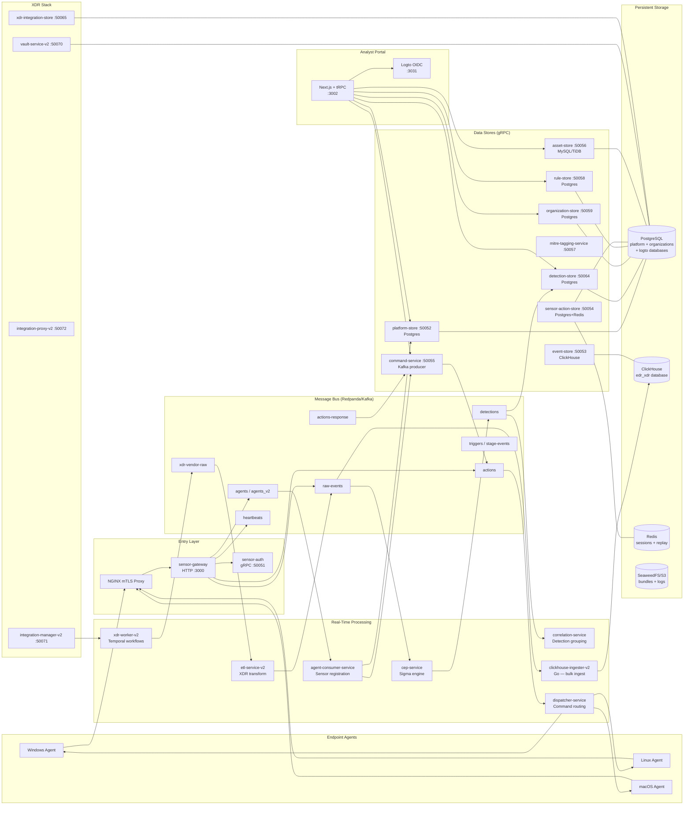

# Phoenix Server — Architectural Overview

## What Is This?

Phoenix is a cloud-hosted, multi-tenant **Endpoint Detection and Response (EDR) / Extended Detection and Response (XDR)** security platform built by Cybereason. Its purpose is to collect security telemetry from customer endpoints, detect threats in real time, and give security analysts a centralized interface to investigate and respond to attacks.

The server-side platform is a **microservices architecture** written primarily in Rust (16+ services) with Go for high-throughput data ingestion and XDR integration workers, and TypeScript/Next.js for the analyst portal. All services communicate via gRPC (internal service mesh) and Redpanda/Kafka (asynchronous event bus). Persistent data lands in PostgreSQL (transactional state) and ClickHouse (security event analytics).

From a customer's perspective: lightweight agents run on their Windows, Linux, and macOS endpoints. Those agents stream security events to the Phoenix server, where automated detection rules fire in real time, analysts are alerted in the portal, and remediation commands (isolate host, kill process, quarantine file) flow back down to the affected endpoint — all without the analyst ever touching the machine directly.

---

## High-Level Architecture Diagram



---

## Service Catalog

| Service | Language | Role | Inbound | Outbound | Persistent Store |
|---|---|---|---|---|---|
| **sensor-gateway** | Rust | HTTP reverse proxy; entry point for all agent traffic | HTTP :3000 (mTLS via NGINX) | Kafka: `raw-events`, `agents`, `agents_v2`, `heartbeats`; gRPC: sensor-auth, platform-store, detection-store, command-service | — |
| **sensor-auth** | Rust | mTLS challenge/response; issues short-lived client certificates | gRPC :50051 | gRPC: platform-store, organization-store; Redis (replay protection) | Redis |
| **platform-store** | Rust | Core sensor CRUD: sensors, groups, policies, blocked hashes, scripts, user sessions | gRPC :50052 | — | PostgreSQL (`platform` db) |
| **event-store** | Rust | gRPC facade for raw event queries over ClickHouse | gRPC :50053 | ClickHouse reads | ClickHouse |
| **sensor-action-store** | Rust | Persists outbound commands and tracks their status | gRPC :50054 | Redis (hot state), PostgreSQL (audit) | PostgreSQL + Redis |
| **command-service** | Rust | Orchestrates analyst commands; publishes to `actions` topic; consumes `actions-response` | gRPC :50055 (+ HTTP :8080) | Kafka: `actions`; gRPC: sensor-action-store, platform-store, detection-store | — |
| **asset-store** | Rust | Device and user asset inventory with merge engine | gRPC :50056 | — | MySQL/TiDB (`asset_store`) |
| **mitre-tagging-service** | Rust | Maps detection engine names to MITRE ATT&CK tactics/techniques (in-memory rule DB) | gRPC :50057 | — | — (in-memory) |
| **rule-store** | Rust | CRUD for detection rules; hot-reloads CEP via `rule-control-events` topic | gRPC :50058 | Kafka: `rule-control-events` | PostgreSQL (`platform` db) |
| **organization-store** | Rust | Users, organizations, roles, licenses; sends org changes to `organization-changes` | gRPC :50059 | Kafka: `organization-changes`; Logto M2M API | PostgreSQL (`organizations` db) |
| **notification-store** | Rust | Notification settings (email, alert thresholds) | gRPC :50060 | — | PostgreSQL |
| **notification-service** | Rust | Triggers and routes notifications on new detections | gRPC :50061 | gRPC: notification-store, notification-dispatcher, detection-store, platform-store, organization-store | — |
| **notification-dispatcher** | Rust | Sends emails via SendGrid or SMTP | gRPC :50062 | SendGrid / SMTP | — |
| **detection-store** | Rust | Persists detections (Malops) and detection events; query API for portal | gRPC :50064 | — | PostgreSQL (`platform` db) |
| **xdr-integration-store** | Rust | XDR integration config, envelopes, checkpoints | gRPC :50065 | — | PostgreSQL |
| **vault-service-v2** | Rust | Per-integration X25519 keypairs and Ed25519-signed public keys (unsealed from file-based master key) | gRPC :50070 | — | PostgreSQL |
| **integration-manager-v2** | Rust | CRUD for XDR integrations; emits test signals | gRPC :50071 | gRPC: xdr-integration-store, integration-proxy-v2 | PostgreSQL |
| **integration-proxy-v2** | Rust | Sole vault-v2 caller; decrypts envelopes and injects auth into upstream HTTP calls | gRPC :50072 | gRPC: vault-service-v2, xdr-integration-store; external vendor APIs | — |
| **etl-service-v2** | Rust | Consumes `xdr-vendor-raw`; applies VRL transforms from S3 bundles; routes to `raw-events` or per-source topic | gRPC :50073 | Kafka: `raw-events`, per-source topics; S3 (bundles) | — |
| **cep-service** | Rust | Sigma rule evaluation engine; consumes `raw-events`, publishes `detections` | Kafka: `raw-events`, `rule-control-events` | Kafka: `detections` | — (in-memory rule state) |
| **correlation-service** | Rust | Groups related detections into attack sessions (Malops); links XDR events to detections | Kafka: `detections` | gRPC: detection-store, organization-store, asset-store | PostgreSQL (via detection-store), ClickHouse |
| **agent-consumer-service** | Rust | Consumes `agents`/`agents_v2` topics; upserts sensor records; triggers policy reconciliation | Kafka: `agents`, `agents_v2`, `heartbeats` | gRPC: platform-store, command-service | — |
| **dispatcher-service** | Rust | Routes commands from `actions` topic to sensor via WNS or MQTT | Kafka: `actions` | MQTT (RMQTT broker), WNS push | — |
| **sensor-discovery-service** | Rust | HTTP service; tells agents which server URL to connect to per region/org | HTTP :8080 | gRPC: organization-store; Kafka: `organization-changes` | — (in-memory cache) |
| **audit-log-consumer** | Rust | Consumes `audit-log` topic; stores audit trail | Kafka: `audit-log` | PostgreSQL | PostgreSQL |
| **ioc-lookup-service** | Rust | Threat intel IOC lookup via Unix Domain Socket (DaemonSet co-location) | UDS | — | In-memory / file |
| **cep-chainmaker** | Rust | Assembles multi-stage CEP chain rules | — | — | — |
| **cep-trigger-assembler** | Rust | Builds trigger packets for chain correlation | Kafka: `stage-events` | Kafka: `triggers` | — |
| **cep-xsf-lookup** | Rust | XSF (cross-source fusion) enrichment for CEP | gRPC | — | — |
| **score-recompute** | Rust | Periodically recomputes detection severity scores | — | gRPC: detection-store | PostgreSQL |
| **case-store / case-service** | Rust | Investigation case management | gRPC | Kafka: `ai-analysis` | PostgreSQL |
| **postgres-ingester** | Rust | Consumes events and writes structured records to PostgreSQL | Kafka | — | PostgreSQL |
| **threat-intel-store** | Rust | Stores and queries threat intelligence (IOC reputation data) | gRPC | — | PostgreSQL |
| **investigation-ai-agent** | Rust | AI-assisted investigation generation | Kafka: `ai-analysis` | External AI API | — |
| **clickhouse-ingester-v2** | Go | Bulk-writes `raw-events` Kafka messages to ClickHouse with back-pressure control | Kafka: `raw-events` | ClickHouse | ClickHouse |
| **xdr-worker-v2** | Go | Temporal workflow worker; executes scheduled XDR fetch pipelines; publishes to `xdr-vendor-raw` | Temporal task queue; gRPC server | Kafka: `xdr-vendor-raw`; gRPC: xdr-integration-store, integration-proxy-v2, etl-service-v2 | S3 (oversized payloads) |
| **xdr-worker (v1)** | Go | Legacy XDR worker (being superseded by v2) | Kafka | Kafka | — |

---

## Data Flow: Event Ingestion (Agent → Storage)

1. The endpoint agent authenticates to the platform by calling `sensor-gateway` at `/auth/challenge/initiate` and `/auth/challenge/solve`. `sensor-auth` (gRPC :50051) validates the challenge response, verifies the agent's mTLS client certificate against the CA, and issues a short-lived certificate if successful.

2. The authenticated agent sends a batch of security events via `POST /api/v1/orgs/{org_id}/sensors/{sensor_id}/events` to `sensor-gateway`. The gateway validates the request (authenticates via the `Authorization` header or mTLS header set by NGINX), extracts `org_id` and `sensor_id` from the URL path, and publishes each event as a serialized protobuf `SingleEvent` message to the `raw-events` Kafka topic.

3. `clickhouse-ingester-v2` (Go) consumes the `raw-events` topic. It batches messages (default batch size 5,000) and bulk-inserts them into the `edr_xdr.raw_events_local` ClickHouse table. A back-pressure controller pauses Kafka consumption when ClickHouse queue depth exceeds configurable degraded/critical thresholds.

4. In parallel, `cep-service` also consumes `raw-events`. For each event it evaluates all loaded Sigma detection rules in a parallel worker pool. A match produces a `Detection` protobuf message published to the `detections` topic.

5. `event-store` (gRPC :50053) provides a query facade over ClickHouse for portal queries (search, timeline, attack path) without additional ingestion.

At the end of this flow, every raw event exists in ClickHouse under `edr_xdr.raw_events_local`, partitioned by `(org_id, date)`, with a configurable retention TTL (default 21 days hot, then move to cold or delete).

---

## Data Flow: Detection and Alerting

1. `cep-service` publishes a `Detection` protobuf to the `detections` Kafka topic whenever a Sigma rule fires on an incoming event. The detection message carries `org_id`, affected sensor, rule metadata, MITRE tags, severity, and a reference to the source event.

2. `correlation-service` consumes `detections`. It keeps a rolling in-memory window of recent detections (configurable, default 10,000) and applies temporal correlation rules:
   - **Same-type correlation**: multiple firings of the same rule on the same host within a configurable window are grouped.
   - **Attack session grouping**: detections from different rules on the same host within 5 minutes are assembled into a parent Malop with child detections.
   - **XDR event linking**: a background task periodically queries ClickHouse to associate raw XDR events with detections by time window.

3. `correlation-service` calls `detection-store` (gRPC :50064) to persist the final detection/Malop record to PostgreSQL.

4. `mitre-tagging-service` (gRPC :50057) can be called during or after persistence to enrich the detection with MITRE ATT&CK tactic and technique labels matched by the rule's `engine_specific_name`.

5. `notification-service` monitors `detection-store` for new high-severity detections and, based on per-org email alert settings from `notification-store`, calls `notification-dispatcher` to send emails via SendGrid or SMTP.

6. The portal queries `detection-store` through tRPC/gRPC to display the Malop list, timeline, and attack-path graph. `score-recompute` periodically recalculates detection severity scores stored in PostgreSQL.

---

## Data Flow: Command and Control (Portal → Agent)

1. An analyst in the portal selects an action (e.g., "Isolate Host", "Kill Process", "Quarantine File", "Execute Script") via a tRPC call to the portal's Next.js backend, which calls `command-service` (gRPC :50055).

2. `command-service` validates the request, checks permissions (via `organization-store`), and records a pending action via `sensor-action-store` (gRPC :50054), which writes to PostgreSQL and a Redis hot-state key.

3. `command-service` publishes an `Action` protobuf message to the `actions` Kafka topic. It also spawns a background `ActionRetryJob` that periodically re-publishes pending actions that have not received a response, using a distributed lock from `platform-store` to prevent duplicate retries.

4. `dispatcher-service` consumes the `actions` topic. Based on the target sensor's connectivity type (Windows Notification Service or MQTT), it routes the action to the appropriate transport:
   - **WNS**: sends a push notification to the Windows sensor via the WNS API.
   - **MQTT**: publishes a command payload to the RMQTT broker, which the agent subscribes to.

5. The agent receives the command, executes it, and sends the result back to `sensor-gateway` via `POST /api/v1/orgs/{org_id}/sensors/{sensor_id}/actions/response`. The gateway publishes the `ActionResponse` protobuf to the `actions-response` Kafka topic.

6. `command-service` consumes `actions-response` and calls `sensor-action-store` to update the action status (Succeeded, Failed, Timeout, etc.) in PostgreSQL and Redis.

7. The portal polls `command-service` or `sensor-action-store` via gRPC to display live action status to the analyst.

---

## Portal (TypeScript/Next.js)

### Tech Stack

- **Framework**: Next.js 16 (App Router, server components by default)
- **API layer**: tRPC 11 with Zod validation
- **Database**: Drizzle ORM (PostgreSQL, for portal-internal state only)
- **Auth**: NextAuth v5 backed by Logto OIDC
- **Backend calls**: Connect-RPC (`@connectrpc/connect`) over gRPC-Web for all backend service calls
- **State management**: React Query (server state via tRPC), Zustand (client state)
- **Styling**: Tailwind CSS (static class names only)
- **i18n**: next-intl with `en.json`, `ja.json`, `es.json`, `de.json`
- **Testing**: Vitest (unit), Playwright (E2E)
- **Package manager**: Bun

### tRPC Routers and Their Responsibilities

| Router file | What it manages |
|---|---|
| `malop.ts` | Detection/Malop list, detail, overview, timeline, attack path graph |
| `sensor.ts` | Sensor list, detail, group assignment, policy assignment, filter metadata |
| `sensor-group.ts` | Sensor group CRUD and membership |
| `event.ts` / `events.ts` | Raw event search, timeline, event detail |
| `asset.ts` | Device and user asset queries |
| `rule.ts` | Detection rule management |
| `rule-group.ts` | Rule group CRUD |
| `policy.ts` | Sensor policy management |
| `organization.ts` | Organization settings, hierarchy |
| `user-management.ts` | User CRUD, invitation |
| `role-management.ts` | RBAC role management |
| `user-group-management.ts` | User group management |
| `batch-action.ts` | Bulk analyst actions (isolate, kill, quarantine) |
| `kill-process.router.ts` | Kill process action |
| `quarantine.router.ts` | File quarantine action |
| `prevent-execution.router.ts` | Blocked hash (execution prevention) management |
| `dfir-script.ts` | Remote script management |
| `investigation.ts` / `investigation-cases.ts` | Case and investigation management |
| `chat.ts` / `chat-conversation.router.ts` / `chat-thread.router.ts` | Detection-scoped AI chat |
| `dashboard.ts` | Dashboard widgets and metrics |
| `device.ts` | Device-centric queries |
| `reputation.ts` | IOC reputation lookups |
| `feature-flags.ts` | Unleash feature flag queries |
| `installer.router.ts` | Agent installer download URLs |
| `saved-queries.ts` | User-saved event search queries |
| `xdr-integration/` / `xdr-integration-v2/` | XDR integration CRUD and scheduling |
| `xdr-action-log.ts` | XDR action execution log |
| `admin-integration-*.ts` | Admin integration catalog management |
| `ai-event-search.ts` | AI-assisted event search |
| `entitlements.ts` | License feature gating |
| `syslog-pusher.ts` | Syslog forwarding configuration |
| `email-notification-settings.ts` | Email notification preferences |
| `exclusion.router.ts` | Detection exclusion rules |
| `platform-admin.ts` | Platform administration |
| `user-preferences.ts` | Per-user portal preferences |
| `audit-log-consumer` | (indirect) Audit trail display |

### Key Pages and Features

The portal app lives under `src/app/[locale]/(with-sidebar)/` and includes:
- **Malop Management**: detection alert list, filters, MITRE heatmap, severity scoring
- **Event Explorer**: raw event search with dynamic filters, timeline, attack path visualization
- **Sensor Management**: endpoint inventory, online/offline status, policy assignment, group management
- **Asset Inventory**: unified device and user asset view
- **Investigation Cases**: AI-assisted investigation workflows
- **XDR Integrations**: connector management for external data sources
- **Policy Management**: sensor behavioral policy editor
- **Rule Management**: detection rule authoring and activation
- **Administration**: user/org management, role assignments, notification settings, feature flags

---

## Shared Schemas (Protobuf)

Proto source lives in `modules/proto/proto/` (git submodule). Rust services compile via `rust/pbgen` (tonic + prost). Go services use `golang/pbgen`. The portal uses `@bufbuild/protobuf` + ConnectRPC generated TypeScript.

| Message Type | Key Fields | Producer Service | Consumer Service(s) | Kafka Topic |
|---|---|---|---|---|
| `SingleEvent` (legacy) | org_id, sensor_id, event_kind, timestamp, process/network/file fields | sensor-gateway (legacy agents topic) | agent-consumer-service | `agents` |
| `FullAgentInfo` | core.id, core.type, org_id (header), version, policy_id | sensor-gateway | agent-consumer-service | `agents_v2` |
| `SingleEvent` (events) | org_id, sensor_id, event_id (ULID/UInt128), event_kind, ECS fields | sensor-gateway | cep-service, clickhouse-ingester-v2 | `raw-events` |
| `Detection` | org_id, sensor_id, detection_id, rule_name, engine_specific_name, severity, MITRE tags, source_event_ref | cep-service | correlation-service, detection-store (consumer), notification-service | `detections` |
| `CoreAgentInfo` | agent id, version, OS, hostname, org_id | sensor-gateway | agent-consumer-service | `agents_v2` (embedded in `FullAgentInfo`) |
| `Action` | org_id, sensor_id, action_id, action_type, parameters | command-service | dispatcher-service | `actions` |
| `ActionResponse` | org_id, sensor_id, action_id, status, result | sensor-gateway | command-service | `actions-response` |
| `Trigger` | org_id, detection chain references | cep-trigger-assembler | cep-chainmaker / correlation-service | `triggers` |

---

## Infrastructure

### ClickHouse

- **Database**: `edr_xdr` (created on cluster `edr_xdr_cluster`)
- **Main table**: `edr_xdr.raw_events_local` — a `ReplicatedMergeTree` table partitioned by `(org_id, toDate(timestamp))`. Every tenant's events are physically isolated by `org_id` as the first partition key.
- **Key columns**: `org_id` (Int64), `event_id` (UInt128 ULID), `event_kind`, `event_source` (edr/xdr), `retention_days` (default 21), ECS-mapped process/network/file/user fields.
- **Retention**: A TTL rule moves data to cold storage after `retention_days` days; rows can be deleted if `retention_days` is below the move threshold.
- **Distributed table**: `edr_xdr.raw_events` — the distributed view across all shards for cluster-wide queries.
- **Coordination**: Apache ZooKeeper (for ReplicatedMergeTree metadata).

### PostgreSQL

Three logical databases are provisioned in a single PostgreSQL 16 instance:

| Database | Owner service(s) | Key tables |
|---|---|---|
| `platform` | platform-store, detection-store, rule-store, sensor-action-store, correlation-service, notification-store | `sensors`, `sensor_groups`, `policies`, `malop_detections`, `detection_events`, `batch_actions`, `sensor_actions`, `detection_rules`, `detection_exclusions`, `malop_exclusions`, `blocked_hashes`, `scripts`, `remote_shell_connections`, `usage_reports`, `saved_queries`, `scheduled_jobs` |
| `organizations` | organization-store | `organizations`, `users`, `roles`, `role_assignments`, `licenses`, `organization_users` |
| `logto` | Logto OIDC server | OIDC identity data (managed by Logto internally) |

### Redpanda/Kafka Topics

| Topic | Schema / Format | Purpose | Primary Producer | Primary Consumer(s) |
|---|---|---|---|---|
| `raw-events` | Protobuf `SingleEvent` | Security telemetry from sensors and XDR ETL | sensor-gateway, etl-service-v2 | cep-service, clickhouse-ingester-v2 |
| `detections` | Protobuf `Detection` | Fired detection alerts | cep-service | correlation-service, detection-store, notification-service |
| `agents` | Protobuf `SingleEvent` (legacy) | Legacy agent registration/update | sensor-gateway | agent-consumer-service |
| `agents_v2` | Protobuf `FullAgentInfo` | Modern agent registration/update | sensor-gateway | agent-consumer-service |
| `heartbeats` | Lightweight heartbeat | Sensor liveness (last-seen-time updates) | sensor-gateway | agent-consumer-service |
| `actions` | Protobuf `Action` | Commands to sensors | command-service | dispatcher-service |
| `actions-response` | Protobuf `ActionResponse` | Command execution results from sensors | sensor-gateway | command-service |
| `triggers` | Protobuf `Trigger` | Multi-stage attack chain triggers | cep-trigger-assembler | correlation-service / cep-chainmaker |
| `stage-events` | Protobuf detection stages | Intermediate stages for chain correlation | cep-service | cep-trigger-assembler |
| `rule-control-events` | Rule config change events | Hot-reload detection rules in cep-service | rule-store | cep-service |
| `organization-changes` | Organization change events | Org config propagation | organization-store | sensor-discovery-service, sensor-auth |
| `audit-log` | Audit record | Security audit trail | various services | audit-log-consumer |
| `xdr-vendor-raw` | Vendor log payloads (any format) | Raw external data (SIEM/cloud/SaaS logs) | xdr-worker-v2 | etl-service-v2 |
| `xdr-assets` | Protobuf `AssetInstance` | XDR-derived asset records | etl-service-v2 | asset-store consumer |
| `ai-analysis` | AI trigger messages | Triggers AI investigation analysis | case-service | investigation-ai-agent |
| `dead-letter-queue` | Failed messages | DLQ for unprocessable messages | various | manual inspection |
| `cep-stage-filter-gossip` | Gossip (compacted) | Inter-instance CEP stage filter coordination | cep-service | cep-service (all instances) |
| `threat-intel` | IOC records (compacted) | Broadcast IOC feed for Flink state | threat-intel-store | Flink jobs, cep-service |

### Apache Flink

Flink is present in the infrastructure (ZooKeeper + Flink Dashboard at :8081) and is referenced in CEP rule configuration. Its role is real-time Complex Event Processing (CEP) over the `raw-events` and `triggers` streams for multi-stage attack chain detection. CEP rules expressed in the YAML format under `cep-rules/` define:

- `correlation.type: temporal` — time-windowed multi-stage patterns
- `chains` — field-equality linking conditions between detection stages
- `phoenix.interval` — polling/evaluation interval
- `phoenix.trigger` — which stage fires the alert

Flink jobs consume `raw-events` and `triggers`, evaluate these multi-stage rules, and emit matched detections or trigger packets back to Kafka.

### gRPC Service Port Reference

| Port | Service |
|---|---|
| 50051 | sensor-auth |
| 50052 | platform-store |
| 50053 | event-store |
| 50054 | sensor-action-store |
| 50055 | command-service |
| 50056 | asset-store |
| 50057 | mitre-tagging-service |
| 50058 | rule-store |
| 50059 | organization-store |
| 50060 | notification-store |
| 50061 | notification-service |
| 50062 | notification-dispatcher |
| 50064 | detection-store |
| 50065 | xdr-integration-store |
| 50070 | vault-service-v2 |
| 50071 | integration-manager-v2 |
| 50072 | integration-proxy-v2 |
| 50073 | etl-service-v2 (health/gRPC) |
| 50081 | xdr-worker-v2 (gRPC) |

---

## Multi-Tenancy Model

Phoenix is a hard multi-tenant system. Every data store enforces tenant isolation via `org_id`.

**Authentication → org_id establishment**:
- Human analysts authenticate to the portal via Logto OIDC. The session carries an `org_id` claim. NextAuth (via `organization-store`) validates the user belongs to that organization. The portal backend always derives `org_id` from the validated session context — it is never accepted as a raw user input.
- Endpoint agents authenticate via the mTLS challenge flow in `sensor-auth`. The `org_id` is encoded in the URL path (`/api/v1/orgs/{org_id}/...`) and is verified against the organization's enrollment settings cache (populated from `organization-store` via Kafka).

**Database queries**:
- Every PostgreSQL query in every Rust service includes `WHERE org_id = $1` as the first filter, enforced by convention and code review. The `org_id` is never accepted from request bodies — it is always sourced from the authenticated session or validated path parameter.
- ClickHouse tables are partitioned by `(org_id, date)`. Queries from `event-store` always include `org_id` as the leading partition filter, which also physically prevents cross-tenant data access on multi-shard deployments.
- The asset store (MySQL/TiDB) scopes all device and user records by `org_id`.

**Kafka messages**:
- Every message on every Kafka topic includes `org_id` either in the protobuf payload or as a Kafka message header (agents_v2 topic). Consumers re-validate `org_id` against the organization registry on receipt.

**gRPC calls**:
- All inter-service gRPC requests include `org_id` in the request message. Receiving services validate it against their own data or against `organization-store`. OpenTelemetry trace spans record `org_id` as a first-class attribute for audit and debugging.

---

## Development Setup

### Prerequisites

```bash
# Install all tools (Rust toolchain, Go, Bun, buf, etc.)
mise install
```

### Start the Full Dev Environment

```bash
cd projects/Phoenix/local/dev0

# Start all services (builds Rust and Go binaries, runs migrations, seeds data)
./start.sh

# Start with full CI build (no cache)
./start.sh --ci

# Stop all services
./kill.sh

# Full rebuild from scratch (removes volumes)
./kill.sh --full

# Follow logs for a specific service
docker compose logs -f sensor-gateway
docker compose logs -f cep-service
```

### Run Tests

```bash
# Rust — all workspace tests
cargo test --workspace

# Rust — single crate / single test
cargo test -p platform-store sensor_registration

# Go
go test ./...

# TypeScript
bun test
bun run test:e2e   # Playwright E2E (from phoenix-portal/)
```

### Regenerate Protobuf

```bash
# All languages
cd modules/proto && buf generate

# Rust only (requires build-proto feature)
cd rust/pbgen && cargo build --features build-proto

# TypeScript/portal only
cd phoenix-portal && ./scripts/generate-proto.sh
```

### Linting

```bash
cargo clippy            # Rust
gofmt ./... && go vet ./...  # Go
cd phoenix-portal && bun run lint   # TypeScript
buf lint                # Protobuf
```

### Dev Service URLs

| Service | URL |
|---|---|
| Portal (dev) | http://localhost:3002 |
| Logto (OIDC) | http://localhost:3031 |
| Logto Admin | http://localhost:3032 |
| Redpanda Console | http://localhost:8080 |
| ClickHouse HTTP | http://localhost:8123 |
| PostgreSQL | localhost:5432 |
| Flink Dashboard | http://localhost:8081 |
| OpenObserve (traces) | http://localhost:5080 |
| pgAdmin | http://localhost:5050 |
| SeaweedFS S3 | http://localhost:8333 |
| Mailpit (dev email) | http://localhost:8025 |
| Unleash (feature flags) | http://localhost:4242 |
| RMQTT (MQTT) | localhost:1883 |

---

## Glossary

| Term | Definition |
|---|---|
| **EDR** | Endpoint Detection and Response. Security software that monitors endpoints (laptops, servers) for malicious behavior, records telemetry, and enables remote remediation. |
| **XDR** | Extended Detection and Response. Extends EDR by ingesting telemetry from external sources beyond the endpoint — cloud, SaaS, network logs — for unified threat detection. |
| **Sensor / Agent** | A lightweight piece of software installed on a customer's endpoint that collects security events and sends them to the Phoenix server. |
| **CEP** | Complex Event Processing. Real-time pattern matching over event streams, used in Phoenix to evaluate Sigma detection rules and multi-stage attack chain patterns (Flink jobs + cep-service). |
| **Sigma** | An open, vendor-neutral rule format for detection engineering. Phoenix's `cep-service` evaluates Sigma rules expressed in YAML against the `raw-events` stream. |
| **Detection / Malop** | A detection (also called a Malop, short for Malicious Operation) is a confirmed security incident produced by the correlation engine. A single Malop groups multiple individual detection firings from one attack session. |
| **Correlation** | The process of grouping related individual detections (same rule firing multiple times, or different rules firing on the same host) into a single coherent Malop. |
| **Trigger** | In the CEP chain context, a trigger is a Kafka message that links a stage-1 detection event to a multi-stage correlation rule, allowing Flink or `cep-chainmaker` to track whether all stages of a multi-step attack pattern have fired. |
| **MITRE ATT&CK** | A publicly maintained knowledge base of adversary tactics and techniques. Phoenix tags detections with MITRE tactic (TA) and technique (T) IDs to help analysts understand attacker intent. |
| **Org / org_id** | A customer organization (tenant). Every piece of data in the system is scoped to an `org_id`. Phoenix is a multi-tenant SaaS; one server deployment hosts multiple customer organizations with strict data isolation. |
| **Action** | A command dispatched from the portal to a sensor (e.g., isolate network, kill process, quarantine file, run script). Actions flow through command-service → Kafka `actions` → dispatcher-service → MQTT/WNS → agent. |
| **mTLS** | Mutual TLS. Both the sensor and the server present certificates during the TLS handshake. `sensor-auth` issues client certificates to authenticated sensors, which are validated by NGINX on every subsequent request. |
| **VRL** | Vector Remap Language. A scripting language used in the XDR ETL pipeline (`etl-service-v2`) to transform raw vendor log payloads into normalized `SingleEvent` protobuf format. |
| **Temporal** | A workflow orchestration platform used by `xdr-worker-v2` to schedule and reliably execute XDR integration fetch pipelines (poll external APIs, transform data, publish to Kafka). |
| **Malop Score** | A severity score assigned to a Malop based on the combination of detection rules fired, MITRE tactics matched, and asset criticality. Recomputed periodically by `score-recompute`. |
| **Vault** | The `vault-service-v2` manages per-integration cryptographic keypairs. Integration credentials are stored encrypted (envelope encryption) and only decrypted ephemerally by `integration-proxy-v2` during an actual API call. |
