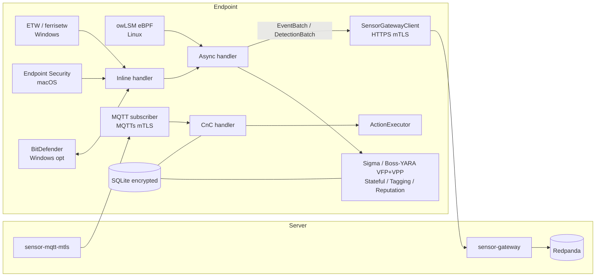

# Phoenix Agent (Sunbird) — Project Summary

## One-Line Description
A single-binary Rust EDR/XDR endpoint sensor that collects OS-level telemetry, runs local detection, and executes response actions for the Phoenix cloud platform.

## Purpose
Sunbird is the endpoint component of Cybereason's Phoenix EDR/XDR platform. It is deployed by IT/security teams onto customer Linux, macOS, and Windows machines to silently observe OS activity (process, file, network, registry, shell), stream telemetry to the Phoenix cloud, evaluate Sigma/YARA rules locally for inline prevention, and execute response commands (kill, isolate, quarantine, run script) received from the server. Most heavy correlation runs server-side in Apache Flink; the agent focuses on low-latency capture and prevention.

## Tech Stack
- **Language**: Rust (workspace), compiled with `lto = "thin"`, `panic = "abort"`, `mimalloc` allocator
- **Key crates**: `tonic`/`prost` (Protobuf), `reqwest` (blocking HTTPS+mTLS), `rustls` (TLS 1.3), `rumqttc` (MQTT over TLS), `tracing`/`tracing-subscriber`, `clap`, `crossbeam-channel`, `sigma-rust` (custom), `endpoint_sec`, `ferrisetw`, `flatbuffers`, `ed25519-dalek`, `p256`, `sqlcipher` (SQLite), `zstd`
- **Supported OSes**: Linux (systemd, .deb/.rpm), macOS (LaunchDaemon, .pkg), Windows (Service, MSI)
- **Wire formats**: Protobuf + zstd (events/detections), FlatBuffers (owLSM IPC)

## Architecture at a Glance



## Key Components

| Crate | Platform | Role |
|---|---|---|
| `phoenix-sunbird` | all | Main binary, owns `Application` startup, wires everything |
| `sunbird-detection-pipeline` | all | Inline + async pipeline, engine registry, tagging, reputation |
| `sunbird-auth` | all | Enrollment + cert challenge/solve, short-/long-term cert lifecycle |
| `sunbird-keystore` | all | Key/cert storage (Windows CNG vs file-based) |
| `sunbird-secret` | all | HKDF + DPAPI/file-based DEK derivation for SQLite encryption |
| `sunbird-identity` | all | `AgentId`, `OrganizationId/Key`, Protobuf conversion |
| `sensor-gateway-client` | all | HTTPS+mTLS REST client (events, detections, policy, reputation) |
| `sigma-rust` | all | Custom Sigma rule parser + evaluator |
| `owlsm-rs` | linux | Spawns external owLSM eBPF binary, reads FlatBuffer events from stdout |
| `sunbird-endpoint-sec-macos` | macos | Apple Endpoint Security framework client |
| `wfp-rs` | windows | Windows Filtering Platform wrapper for host isolation |
| `bitdefender/*` | windows | Optional BitDefender on-access scanning, AMSI, ATC |

## Agent Lifecycle

1. **Process start** — OS launches `phoenix-sunbird` (systemd/LaunchDaemon/Service); `clap` parses flags/env.
2. **Observability init** — `tracing-subscriber` + panic hook + metrics file-writer thread.
3. **Identity resolution** — Load `AgentId` from registry/plist/file, or generate UUID-like ID and persist.
4. **Local state** — Open encrypted SQLite at `{data_dir}/cybereason-agent.db`; DEK derived via HKDF (DPAPI on Windows).
5. **Detection pipeline spawn** — Load embedded Sigma + Boss/YARA VFP/VPP bundles; allocate inline + async channels.
6. **Cached policy + reputation load** — `SensorPolicyController` and `ReputationController` from SQLite (offline-capable).
7. **Platform collector start** — ETW (Windows) / Endpoint Security (macOS) / owLSM subprocess (Linux).
8. **Network init thread** — Discovery -> enrollment (or re-enroll) -> short-term cert -> auth worker (renewal every 1 min check).
9. **Gateway client + first agent-info push** — `PUT /agents/{id}` with `FullAgentInfo`.
10. **Policy fetch + MQTT subscribe** — Subscribe topic `commands/organizations/{org}/sensors/{id}` (QoS 1, clean session).
11. **Steady state** — Events stream out; commands stream in.
12. **Shutdown** — `ShutdownManager` drains components in order with 20s timeout.

## Platform Support

| OS | Event Collection | Key APIs Used |
|----|------------------|---------------|
| Linux | External owLSM eBPF subprocess; FlatBuffer events on stdout | LSM hooks, BPF tracepoints, `CAP_BPF`/root |
| macOS | In-process Endpoint Security client (notify mode) | `es_new_client`, `ES_EVENT_TYPE_NOTIFY_*`, FDA + entitlement |
| Windows | ETW kernel real-time consumer; optional BitDefender inline callbacks | `ferrisetw`, kernel ETW providers, WFP, BD SDK |

## Cloud Communication
- **Telemetry**: HTTPS REST + mTLS (TLS 1.3 via rustls) to `sensor-gateway`; `EventBatch` and `DetectionBatch` Protobuf, zstd level 3, 30s timeout.
- **Commands**: MQTT over TLS (`rumqttc`) with `clean_session=true`, re-subscribe on every `ConnAck`. Windows tries WNS first.
- **Auth**: Short-term ECDSA P-256 X.509 cert presented for mTLS; long-term cert renews at ~70% of lifetime with jitter.
- **Reconnection**: Exponential backoff 2s -> 300s for discovery/enrollment.

## Local Detection
Five engines run via `sunbird-detection-pipeline`: Sigma, Boss+YARA VFP (file), Boss+YARA VPP (memory), Stateful (injection chains, capped at 1,000 instances), Tagging. The **inline path** must return Allow/Deny within a 3-second budget for OS callbacks (Sigma + VFP + VPP, no stateful); the **async path** runs the full registry on all events with `try_send` drop semantics. Reputation cache short-circuits process-creation events before engines run.

## Security Model
- **Identity**: 128-bit random `StaticAgentId` from OS CSPRNG, persisted across reboots/upgrades.
- **Cert lifecycle**: Two-phase — initial enrollment via ephemeral Ed25519 + PoW (BLAKE3) on plain HTTPS; long-term P-256 cert returned; short-term cert issued over mTLS; auth worker renews on schedule.
- **Key storage per OS**:
  - Windows: Windows Certificate Store (CNG, NCrypt) — non-exportable
  - macOS: file-based DER in `{data_dir}/keystore/` (FIXME comment notes Keychain not yet integrated)
  - Linux: file-based DER in `{data_dir}/keystore/`
- **DB encryption**: SQLite via sqlcipher; DEK derived HKDF(static_key, agent_id) wrapped by DPAPI on Windows or file-based on Linux/macOS.

## Code Quality Snapshot

| Metric | Value |
|--------|-------|
| Overall score | 6.5/10 |
| Top strength | Well-layered enrollment/mTLS protocol, clean shutdown sequencing, structured `tracing` with `org_id`, isolated owLSM subprocess |
| Top concern | Linux/macOS store mTLS private keys as plaintext DER files; `unsafe_code = "forbid"` not set at workspace level |
| Critical issues | 4 — unsafe lint missing; plaintext keystore on Linux/macOS; compile-time mTLS bypass `SUNBIRD_FORCE_DISABLE_MQTTS`; startup `panic!`/`.expect()` paths under `panic = "abort"` |

## Top 3 Security Risks

1. **Plaintext mTLS private key on Linux/macOS** — `FileBasedKeystore` writes the long-term private key as raw DER with no per-file encryption or strict `0o600` enforcement at file level. A local same-user process can impersonate the sensor. See `crates/sunbird-keystore/src/lib.rs:58-61` and `crates/sunbird-keystore/src/file/mod.rs:39-43`.
2. **Compile-time mTLS bypass via env var** — `option_env!("SUNBIRD_FORCE_DISABLE_MQTTS")` at `crates/phoenix-sunbird/src/app.rs:1071-1076` silently disables MQTT mTLS in any build it was set for, with only an `info!` log at runtime. No build-time guard against use in production.
3. **Static HKDF key recoverable from binary on Linux/macOS** — `LONG_TERM_STATIC_KEY_OBFUSCATED` at `crates/sunbird-secret/src/static_key/long_term.rs:16-19` is XOR-obfuscated with `0xBD`. Combined with the plaintext-stored agent ID, an attacker who reads the binary can decrypt the platform parameters file (no DPAPI/Keychain on these OSes).

## How to Build

```bash
cd projects/phoenix-agent
cargo build
cargo test --workspace
```

## Key Files to Know

- `projects/phoenix-agent/crates/phoenix-sunbird/src/app.rs` — `Application::initialize()`, the startup orchestrator wiring storage, pipeline, collectors, network, MQTT, shutdown.
- `projects/phoenix-agent/crates/sunbird-detection-pipeline/src/lib.rs` — Inline + async dispatch, engine registry, channel topology (note unbounded channels at lines 401-402).
- `projects/phoenix-agent/crates/sunbird-auth/src/enrollment.rs` — Enrollment state machine, challenge solve, cert renewal.
- `projects/phoenix-agent/crates/sunbird-keystore/src/lib.rs` — `load_keystore()` selects Windows CNG vs file-based; the `FIXME` keystore stopgap lives here.
- `projects/phoenix-agent/crates/sensor-gateway-client/src/client.rs` — REST client surface (events, detections, policy, reputation, installer URL).
- `projects/phoenix-agent/crates/owlsm-rs/src/pipeline.rs` — Linux subprocess management and FlatBuffer event forwarder (bounded channel 256).
- `projects/phoenix-agent/Cargo.toml` — Workspace lints/profile; the place to add `unsafe_code = "forbid"`.
