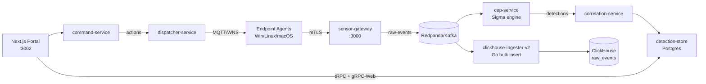

# Phoenix Server — Project Summary

## One-Line Description
Phoenix is Cybereason's cloud-hosted, multi-tenant EDR/XDR platform that ingests endpoint and external telemetry, detects threats in real time, and dispatches remediation commands back to agents.

## Purpose
Phoenix solves the problem of detecting and responding to security incidents across thousands of customer endpoints (Windows, Linux, macOS) and external data sources (cloud, SaaS, network). Security analysts use the Phoenix portal to triage detections (Malops), investigate attack chains, and remotely contain affected hosts. The server is built as a microservices platform so individual concerns — ingestion, detection, correlation, command dispatch — can scale and evolve independently.

## Tech Stack
- **Rust** (16+ services): event processing, sensor management, storage gRPC facades, vault, integration proxy
- **Go**: high-throughput data plane (`clickhouse-ingester-v2`, `xdr-worker-v2` on Temporal)
- **TypeScript / Next.js 16**: analyst portal (T3 stack — tRPC 11, Drizzle, NextAuth v5, Zod, Tailwind, Bun)
- **Apache Flink**: multi-stage CEP rule evaluation (`cep-rules/` YAML)
- **ClickHouse** (`edr_xdr` db, partitioned by `org_id`): security event analytics
- **PostgreSQL 16**: transactional state across `platform`, `organizations`, `logto` databases
- **Redpanda / Kafka**: async message bus between all services
- **Redis**: hot action state, mTLS replay protection, sessions
- **MySQL/TiDB**: asset-store
- **Protobuf** (`modules/proto/`): shared schemas for `SingleEvent`, `Detection`, `Action`, `FullAgentInfo`
- **Auxiliary**: Logto OIDC, SeaweedFS/S3, Temporal, RMQTT, NGINX (mTLS), OpenObserve, Unleash

## Architecture at a Glance



## Key Components

| Component | Language | Role |
|-----------|----------|------|
| sensor-gateway | Rust | HTTP/mTLS entry point for all agent traffic; publishes events to Kafka |
| sensor-auth | Rust | mTLS challenge/response; issues short-lived agent client certificates |
| platform-store | Rust | Core CRUD for sensors, groups, policies, blocked hashes, sessions |
| event-store | Rust | gRPC query facade over ClickHouse for portal event search |
| cep-service | Rust | Sigma rule evaluation engine over `raw-events` stream |
| correlation-service | Rust | Groups detections into Malops (attack sessions) |
| command-service | Rust | Orchestrates analyst actions; publishes to `actions` topic with retry |
| dispatcher-service | Rust | Routes commands to agents via MQTT or Windows Notification Service |
| detection-store | Rust | Persists Malops/detections; query API for the portal |
| clickhouse-ingester-v2 | Go | Bulk-writes `raw-events` to ClickHouse with back-pressure control |
| xdr-worker-v2 | Go | Temporal-driven workers fetching external SIEM/cloud telemetry |
| phoenix-portal | TypeScript | Next.js analyst UI (Malops, sensors, investigations, XDR config) |

## Main Data Flows

### 1. Event Ingestion (Agent → Storage)
1. Agent authenticates via `sensor-auth` mTLS challenge and receives a short-lived cert.
2. Agent POSTs event batches to `sensor-gateway` at `/api/v1/orgs/{org_id}/sensors/{sensor_id}/events`.
3. Gateway publishes serialized `SingleEvent` protobufs to the `raw-events` Kafka topic.
4. `clickhouse-ingester-v2` (Go) batches messages and bulk-inserts into `edr_xdr.raw_events_local`.
5. `event-store` exposes a gRPC query facade over ClickHouse for portal searches.

### 2. Detection and Alerting
1. `cep-service` consumes `raw-events` and evaluates loaded Sigma rules in a parallel worker pool.
2. Matches are published as `Detection` protobufs to the `detections` topic.
3. `correlation-service` groups related detections on the same host into Malops, persists via `detection-store` (PostgreSQL).
4. `mitre-tagging-service` enriches each detection with MITRE ATT&CK tactic/technique IDs.
5. `notification-service` dispatches email alerts through `notification-dispatcher` (SendGrid/SMTP).

### 3. Command and Control (Portal → Agent)
1. Analyst triggers an action (isolate / kill process / quarantine) via tRPC; portal calls `command-service`.
2. `command-service` records a pending action in `sensor-action-store` (PostgreSQL + Redis) and publishes an `Action` protobuf to `actions` with retry.
3. `dispatcher-service` routes via MQTT (RMQTT) or Windows Notification Service to the target agent.
4. Agent executes and POSTs response to `sensor-gateway` → `actions-response` topic.
5. `command-service` consumes `actions-response` and updates action status; portal polls for live status.

## External Dependencies
- **Redpanda/Kafka** (message bus, 16+ topics)
- **ClickHouse** + ZooKeeper (event analytics, `ReplicatedMergeTree`)
- **PostgreSQL 16** (`platform`, `organizations`, `logto` databases)
- **Redis** (hot state, replay protection, sessions)
- **MySQL/TiDB** (asset-store)
- **Logto** (OIDC identity provider)
- **Temporal** (XDR workflow orchestration)
- **RMQTT** broker + **WNS** (agent command transport)
- **SeaweedFS/S3** (bundles, oversized payloads)
- **SendGrid/SMTP**, **NGINX** (mTLS termination), **OpenTelemetry** collector

## Multi-Tenancy
Every persisted record carries an `org_id`. The portal derives `org_id` from the NextAuth session — never from user input. PostgreSQL queries always include `WHERE org_id = $1` parameterized. ClickHouse tables are partitioned by `(org_id, date)` for physical isolation. Every Kafka message and gRPC request carries `org_id` and is re-validated by consumers.

## Code Quality Snapshot

| Metric | Value |
|--------|-------|
| Overall score | 7.5/10 |
| Top strength | Multi-tenancy discipline: parameterized SQL with `org_id`, ClickHouse partitioning, session-derived `org_id` in tRPC, IDOR prevention |
| Top concern | Inconsistent standards: `anyhow` in Rust library crates, `xdr-worker` uses `logrus` + wrong env prefix |
| Critical issues | 1 — `event-store` ClickHouse queries use string interpolation (numeric values only, but violates SQL-safety invariant) |

## Top 3 Risks

1. **String-interpolated ClickHouse queries** — `rust/event-store/src/repositories/queries/single_event.rs:136` and `event_repository.rs:189,413,576` use `.replace()` instead of `.bind()`. Safe now (numeric values) but a dangerous template for future maintainers.
2. **Hardcoded default passwords** — `rust/event-store/src/config.rs:59` defaults `CLICKHOUSE_PASSWORD` to `"edrpassword"`; `golang/xdr-worker/config/config.go:61` defaults S3 keys to `"admin"`. Misconfigured deployments silently use these.
3. **`expect()`/`unwrap()` in production paths** — `rust/notification-dispatcher/src/sendgrid.rs:20` and `template_resolver.rs:85` panic on `reqwest::Client` build failure; `rust/idm-service/src/cache.rs:78` unwraps `NonZeroUsize::new(...)`.

## How to Run Locally

```bash
cd projects/Phoenix/local/dev0
./start.sh             # start full dev stack
./start.sh --ci        # full no-cache CI build
./kill.sh --full       # tear down + remove volumes
docker compose logs -f sensor-gateway   # tail a service
```

Key URLs: Portal `:3002` · Redpanda Console `:8080` · ClickHouse `:8123` · Flink `:8081`

```bash
cargo test --workspace                         # Rust tests
go test ./...                                  # Go tests
cd phoenix-portal && bun test                  # portal unit tests
cd modules/proto && buf generate               # regenerate protobufs
```

## Key Files to Know

| File | Purpose |
|------|---------|
| `local/dev0/start.sh` | Single entry point — builds and launches the entire dev stack |
| `modules/proto/proto/` | Protobuf source of truth (`SingleEvent`, `Detection`, `Action`) |
| `rust/sensor-gateway/src/` | Agent entry point — how data enters the system |
| `rust/cep-service/src/` | Sigma detection engine — heart of the detection pipeline |
| `rust/correlation-service/src/` | Turns raw detections into Malops (the analyst-visible alert unit) |
| `rust/command-service/src/` | Outbound command orchestration with retry under distributed lock |
| `phoenix-portal/src/server/api/routers/` | tRPC routers mapping portal actions to backend gRPC calls |
